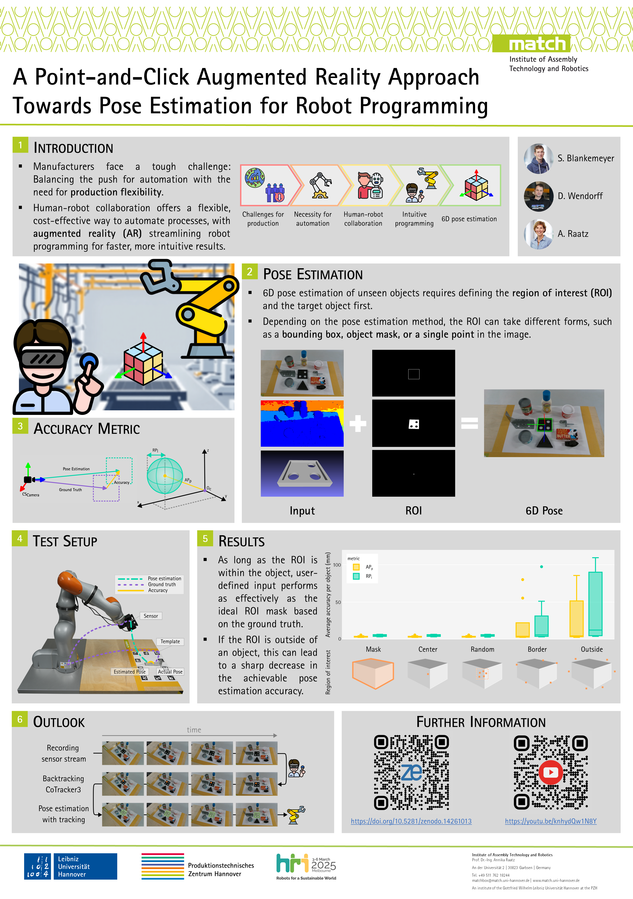

# PoseTestBot

Code for automated, robotic pose estimation dataset acquisition and ground truth annotation.



Further information to follow.

## Installation:
For information on installing FoundationPose, see its repo: [https://github.com/NVlabs/FoundationPose](https://github.com/NVlabs/FoundationPose)

## BibTeX:

**HRI Late breaking report:**
```bibtex
@inproceedings{10.5555/3721488.3721657,
author = {Blankemeyer, Sebastian and Wendorff, David and Raatz, Annika},
title = {A Point-and-Click Augmented Reality Approach Towards Pose Estimation for Robot Programming},
year = {2025},
publisher = {IEEE Press},
abstract = {Augmented Reality (AR)-based programming approaches hold great promise for addressing the challenges of flexible automation by facilitating fast and intuitive programming processes. Pose estimation of novel objects enhances the programming experience by bridging the real and virtual environments. However, a prerequisite for pose estimation is to perform a 2D segmentation to determine the region of interest (ROI). In this work, we present an AR-based approach that enables point-and-click ROI detection through human interaction. Our proof of concept investigates how the achievable accuracy varies with the quality of the user input. The results show that the accuracy of the ROI estimation has a minimal impact on the overall accuracy. Existing limitations can be addressed by other approaches presented.},
booktitle = {Proceedings of the 2025 ACM/IEEE International Conference on Human-Robot Interaction},
pages = {1250–1254},
numpages = {5},
keywords = {augmented reality, hmd, human-robot collaboration, intuitive programming, pose estimation},
location = {Melbourne, Australia},
series = {HRI '25}
}
```

**HRI Data set:**
```bibtex
@dataset{blankemeyer_2025_14261013,
  author       = {Blankemeyer, Sebastian and
                  Wendorff, David and
                  Raatz, Annika},
  title        = {A Point-and-Click Augmented Reality Approach
                   Towards Pose Estimation for Robot Programming
                  },
  month        = mar,
  year         = 2025,
  publisher    = {Zenodo},
  version      = {0.1.0},
  doi          = {10.5281/zenodo.14261013},
  url          = {https://doi.org/10.5281/zenodo.14261013},
}
```

**CIRP CMS paper:**
```bibtex
TBD
```

**CIRP CMS data set:**
```bibtex
TBD
```
