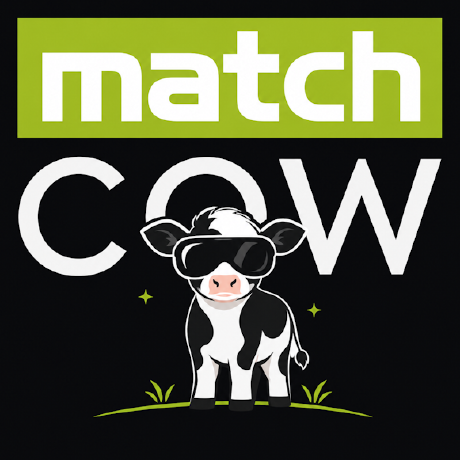

# PoseTestBot

PoseTestBot is a local lab data-acquisition and BOP dataset export tool for
robot-mounted and static RGB-D sensors. Its finish line is a synchronized,
calibrated, inspectable BOP-format dataset with optional BlenderProc-generated
GT/masks.

This repository does not run pose-estimation runtimes, convert estimator output
to BOP result CSVs, run BOP Toolkit evaluation, or export metric reports. Those
downstream workflows should consume this repo's BOP output from a separate
project.

## What Is In Scope

- Fixed real lab iiwa profile with explicit execution safety gates.
- Capture planning, preflight, and supervised capture execution.
- RealSense, OAK-D Pro, and ZED 2i sensor registry/status/capture contracts.
- Non-destructive synchronization under `processed/synchronized/`.
- Sync quality reporting.
- Imported ArUcoGridGen target validation, split marker detection/pose solving,
  optional RealSense color intrinsic calibration, explicit hand-eye/known-grid
  extrinsic solving, selection-gated promotion, and derived RGB-D rectification.
- BlenderProc preparation/render planning for optional GT and masks.
- BOP dataset export, model metadata, targets, frame maps, and optional
  multiview/COCO sidecars.
- React/shadcn operator console backed by the Flask API and local job runner.

## Quick Setup

Install dependencies with `uv`:

```bash
uv sync
```

Run Python entry points through `uv`:

```bash
uv run python scripts/robot_status.py --json
```

## Hardware Profile

Current lab expectations:

- 3 Intel RealSense D435-class cameras.
- 1 Luxonis OAK-D Pro.
- 1 Stereolabs ZED 2i.
- KUKA LBR iiwa at `172.31.1.147:30300`.
- Lab receiver IP on the robot subnet: `172.31.1.169`.
- Normal network IP on the same interface: `10.145.8.132`.

The sole robot profile is the real lab iiwa. Inspect it without sending UDP commands:

```bash
uv run python scripts/robot_status.py
uv run python scripts/robot_status.py --json
```

Check sensors and acquisition runtimes:

```bash
uv run python scripts/sensor_status.py --json
uv run python scripts/sensor_adapters.py --json
uv run python scripts/runtime_status.py --json
```

`runtime_status.py` checks acquisition-relevant external tools only:
BlenderProc for optional GT rendering and the ZED SDK Python module.

## Run Configs

Create an operator intent artifact:

```bash
uv run python scripts/create_run_config.py working_data/example_run
```

Defaults:

- real lab robot profile,
- current lab sensor list,
- `object_models` as the object registry,
- `real_full_capture_validation` as the saved sequence,
- `plan_only=true`.

New run configs also make the robot stream frames explicit:
`robot_flange -> template_base` with `kuka_abc_radians`; optional fixed edges
can describe flange-to-TCP or template-base-to-physical-base transforms. Older
real-profile configs without frame metadata remain readable and receive a
`legacy_frames_inferred` warning; fake-profile configs are rejected.
Object inclusion is an explicit snapshot too. New configs select every valid
registry entry by default; repeat `--object-name NAME` for a subset, or use
`--objectless` for a camera-only RGB-D run. BOP IDs come from the complete
alphabetically sorted registry, so subset IDs can contain gaps. Legacy configs
infer all currently valid objects with a compatibility warning.
For example, a measured flange-to-TCP edge can be recorded at creation time:

```bash
uv run python scripts/create_run_config.py working_data/example_run \
  --fixed-transform-json '{"from":"robot_flange","to":"tcp","rotation_quaternion_wxyz":[1,0,0,0],"translation_mm":[0,0,125]}'
```

Preview the default physical validation workflow without executing it:

```bash
uv run python scripts/create_run_config.py working_data/real_run \
  --sequence real_full_capture_validation \
  --print-sequence-plan
```

Write and queue preflight-aware sequence plans:

```bash
uv run python scripts/run_preflight.py working_data/example_run --write
uv run python scripts/run_pipeline_sequence.py working_data/example_run \
  --sequence sync_to_bop_dry_run --plan-only
```

## Capture

Plan capture startup commands without opening hardware:

```bash
uv run python scripts/run_capture_plan_stage.py working_data/example_run
uv run python scripts/run_capture_plan_preflight.py working_data/example_run
uv run python scripts/run_capture_execution_plan.py working_data/example_run
```

Physical execution is explicitly gated and must be operator-triggered:

```bash
uv run python scripts/run_capture_execution_plan.py working_data/real_run \
  --allow-cameras --allow-real-robot --include-sensors
uv run python scripts/run_capture_execution_stage.py working_data/real_run \
  --allow-cameras --allow-real-robot --include-sensors
```

## Synchronization And Quality

Synchronize without mutating raw capture folders:

```bash
uv run python scripts/sync_run_non_destructive.py working_data/example_run
uv run python scripts/run_sync_quality.py working_data/example_run
```

Derived sync folders are written below:

```text
processed/synchronized/<sensor>/
```

Synchronization is transactional and emits `sync_report.v2` per sensor plus
`sync_quality_report.v2` at run level. Synchronized metadata names the derived
frame paths, retains source-frame provenance, and records any timestamp-source
fallback. Raw frames and raw robot poses are never overwritten; start a new run
root when capture preflight reports existing raw data.

## Calibration

Real grid calibration starts from the exact ArUcoGridGen 1.0 JSON downloaded
for the physically printed, 100%-scale board:

```bash
uv run python scripts/run_calibration_target_import.py working_data/example_run \
  --source working_data/example_run/aruco_grid_config.json \
  --aligned-to-template-base
uv run python scripts/run_aruco_detection_stage.py working_data/example_run
uv run python scripts/run_intrinsic_calibration_stage.py working_data/example_run \
  --mode calibrate
uv run python scripts/run_aruco_pose_stage.py working_data/example_run
uv run python scripts/run_calibration_observations.py working_data/example_run \
  --target-spec calibration_target.json
```

Solve unknown-target and aligned-known-target wrist methods side by side. Static
cameras support only the known-target method:

```bash
uv run python scripts/run_calibration_solver.py working_data/example_run \
  --mode compare
uv run python scripts/run_calibration_validation.py working_data/example_run \
  --select-profile realsense_123=PROFILE_ID
```

When comparison emits two wrist candidates, one repeatable
`--select-profile SENSOR=PROFILE_ID` choice per sensor is mandatory. Promotion
to `calibration_profiles.json` is explicit and writes `calibration.v2` profiles
with native/alpha=0 rectified projections and frame/provenance metadata:

```bash
uv run python scripts/run_calibration_validation.py working_data/example_run \
  --select-profile realsense_123=PROFILE_ID --promote
uv run python scripts/run_camera_rectification.py working_data/example_run
```

Rectification writes only below `processed/rectified/<sensor>/`, using linear
RGB and nearest-neighbor aligned-depth remapping. BlenderProc preparation and
BOP export prefer that tree when present. `run_aruco_stage.py` remains the
factory-intrinsics compatibility wrapper.

## BOP Dataset Export

Prepare optional BlenderProc inputs and render plan:

```bash
uv run python scripts/run_blenderproc_prepare_stage.py working_data/example_run \
  --calibration-profiles working_data/example_run/calibration_profiles.json
uv run python scripts/run_blenderproc_render_stage.py working_data/example_run --dry-run
```

Export BOP dataset structure:

```bash
uv run python scripts/run_bop_export_stage.py working_data/example_run \
  --calibration-profiles working_data/example_run/calibration_profiles.json \
  --object-folder object_models
```

The transactional export emits `bop_export_manifest.v2` and uses standard
BOP-scenewise paths:

```text
bop/
├── dataset_info.json
├── posetestbot_bop_frame_map.json
├── models/
└── <split>/<scene_id>/
    ├── rgb/
    ├── depth/
    ├── scene_camera.json
    ├── scene_gt.json
    ├── scene_gt_info.json
    ├── mask/          # optional
    └── mask_visib/    # optional
```

The preparation and export CLIs accept the same repeatable `--object-name` /
`--objectless` choice. Objectless rendering writes a successful skipped plan
without invoking BlenderProc. Objectless BOP output retains RGB, depth, and
camera metadata, writes empty GT and targets, and contains no models or masks.

The export preserves:

- scene RGB/depth,
- `scene_camera.json`,
- explicit empty or imported `scene_gt*.json`,
- optional `mask/` and `mask_visib/`,
- `bop_export_manifest.json`,
- `posetestbot_bop_frame_map.json`,
- `models/obj_XXXXXX.ply`,
- `models/models_info.json`,
- `test_targets_bop19.json`.

## Pipeline Sequences

Useful presets:

- `real_full_capture_validation`
- `sync_aruco`
- `sync_aruco_calibration_observations`
- `sync_aruco_calibration_candidates`
- `sync_aruco_calibration_solver`
- `sync_aruco_calibration_validation`
- `aruco_grid_full_calibration`
- `calibrated_capture_to_bop_dataset_dry_run`
- `sync_to_bop_dry_run`
- `sync_to_bop_calibrated_dry_run`
- `capture_to_bop_dataset_dry_run`

List current sequences and stages through the Flask API:

```bash
curl http://127.0.0.1:5000/pipeline/stages
curl http://127.0.0.1:5000/pipeline/sequences
```

## Web UI

Start the Flask-backed operator console:

```bash
uv run posetestbot-web
# source-checkout compatibility entrypoint:
uv run python web_interface.py
```

The web server intentionally defaults to unauthenticated `0.0.0.0` for the
trusted lab LAN and still exposes deliberate real-robot controls. Do not expose
it to an untrusted network. Web run paths are confined to `working_data` by
default; add path-list entries with `POSETESTBOT_WEB_RUN_ROOTS`. Read-only
external inputs default to `object_models` and `scripts/default_data`; extend
them with `POSETESTBOT_WEB_INPUT_ROOTS`. Symlink escapes and output paths outside
the selected run are rejected. Installed deployments may set
`POSETESTBOT_APP_ROOT`; otherwise a source checkout is detected automatically
and an installed command uses its current working directory. CLI tools continue
to accept explicit paths.

The bundled console has desktop routes for Dashboard, Devices, Cell, Workflow,
Artifacts, and Jobs. The read-only Cell page renders the HRI template,
base/flange/TCP proxies, calibrated cameras, selected PLY objects, calibration
target, and exact recorded trajectories in right-handed Z-up millimetres.
Missing frame edges remain visibly unresolved, and a component/provenance list
remains available without WebGL. It remembers the selected run, system/light/dark theme,
and manual IIWA target in the browser. Physical capture remains separate from
ordinary stage forms: current preflight evidence is required, camera previews
are stopped first, and two fresh acknowledgements send `allow_cameras` and
`allow_real_robot` together in that one request. A non-plan-only capture
sequence is rejected by `/pipeline/run-config`; use Advanced Capture instead.

The checked-in `posetestbot/web/static/ui/` build is what Flask and installed
wheels serve, so Bun is not a runtime dependency. Frontend development uses the
Bun-locked Vite project:

```bash
cd frontend
bun install --frozen-lockfile
bun run typecheck
bun run lint
bun run build
```

The production build clears the previous output before writing hashed assets.
Use `bash scripts/install.sh --with-web-build` to perform the locked install and
build through the project installer.

Important endpoints:

- `GET /ui/bootstrap`
- `GET /ui/runs`
- `GET /robot/status`
- `POST /run-command`
- `GET /sensors/status`
- `GET /runtime/status`
- `POST /hardware/status`
- `GET|POST /run-config`
- `GET|POST /pipeline/preflight`
- `POST /pipeline/run-config`
- `GET /pipeline/recommendations`
- `GET /artifacts`
- `GET /artifacts/preview`
- `GET /artifacts/file`
- `GET /artifacts/bop-scene`
- `GET /artifacts/bop-frame`
- `GET /artifacts/bop-frame-overlay`
- `GET /capture/jobs`
- `GET /capture/status`
- `POST /capture/jobs/<job_id>/stop`

The artifact browser is scoped to acquisition artifacts, job logs, calibration
reports, BOP scene/frame inspection, and GT/mask overlays.

## Rewrite Gates

Current gates:

- `rewrite_full_capture.v1`
- `rewrite_calibration_validation.v1`
- `rewrite_bop_export_readiness.v1`

Run all gate status summaries:

```bash
uv run python scripts/run_rewrite_status.py working_data/example_run --write
```

## Removed Legacy Entry Points

The destructive multi-camera sync/capture wrappers, `realsense_multi.py`, the
shell BlenderProc wrapper/preparation script, ROI generators, and superseded
transform scripts were removed. Use the supported replacements:

- capture: `run_capture_plan_stage.py`, `run_capture_plan_preflight.py`, and
  `run_capture_execution_stage.py`;
- sync: `sync_run_non_destructive.py` followed by `run_sync_quality.py`;
- BlenderProc: `run_blenderproc_prepare_stage.py` and
  `run_blenderproc_render_stage.py`;
- calibration transforms: the calibration observation, solver, validation, and
  explicit promotion stages.

## Validation

Recommended local validation:

```bash
UV_CACHE_DIR=/tmp/uv-cache uv run pytest
UV_CACHE_DIR=/tmp/uv-cache uv run ruff check .
git diff --check
UV_CACHE_DIR=/tmp/uv-cache uv run pytest tests/test_web_preview_playwright.py
```
