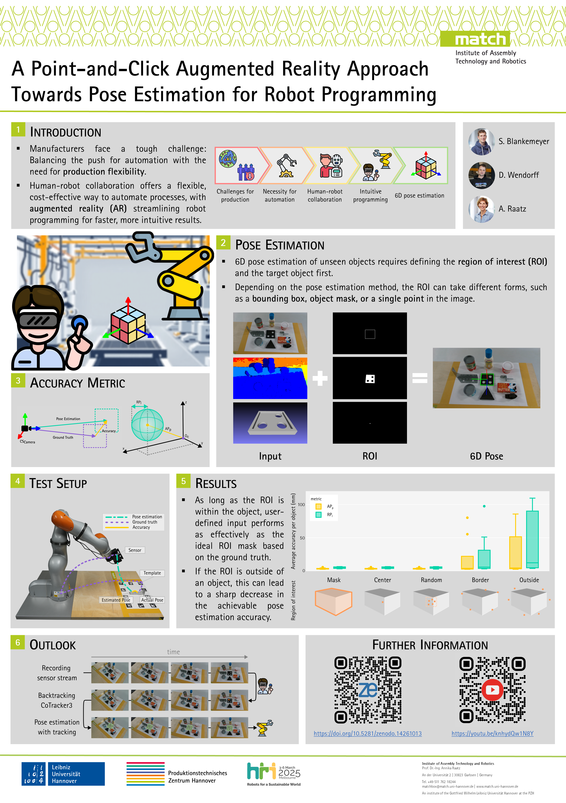

# PoseTestBot

PoseTestBot is a robotic RGB-D capture and 6D pose-estimation evaluation system.
It is being rewritten from a script collection into a modular, manifest-backed
lab tool for KUKA iiwa capture, multi-sensor RGB-D recording, BOP dataset export,
pose-estimator runs, and evaluation.



The current rewrite baseline is in
[docs/SYSTEM_OVERVIEW_REWRITE_BASELINE.md](docs/SYSTEM_OVERVIEW_REWRITE_BASELINE.md).
Ongoing implementation status is tracked in
[docs/REWRITE_PROGRESS.md](docs/REWRITE_PROGRESS.md).

## Development Environment

Use `uv` for Python environments and package management.

```bash
uv sync
uv run python --version
```

Add Python dependencies with `uv add ...` so `pyproject.toml` and `uv.lock` stay
in sync. Avoid ad hoc `pip install` or conda instructions for PoseTestBot itself.
External runtimes such as FoundationPose Docker, MegaPose, SAM6D, BlenderProc,
BOP Toolkit, and the Stereolabs ZED SDK are treated as explicit runtime
profiles.

Check lightweight runtime readiness with:

```bash
uv run python scripts/runtime_status.py
uv run python scripts/runtime_status.py --json
```

MegaPose and SAM6D readiness checks look for `scripts/megapose_wrapper.py` and
`scripts/sam6d_wrapper.py` by default. Set `MEGAPOSE_WRAPPER` or `SAM6D_WRAPPER`
when those wrappers live in an installed external checkout.

## Current Hardware Profile

The lab machine is connected to:

- 3 Intel RealSense cameras.
- 1 Luxonis OAK-D Pro.
- 1 Stereolabs ZED 2i.
- 1 KUKA LBR iiwa robot.

The rewrite is fake-iiwa-first for development and early testing. The default
robot profile points to `127.0.0.1`.

The real robot profile is available but should be selected intentionally:

- Robot IP: `172.31.1.147`
- Robot command port: `30300`
- Lab receiver IP on `enp0s25`: `172.31.1.169`
- Normal network IP on `enp0s25`: `10.145.8.132`
- Receiver UDP port: `8080`

Select the real robot with:

```bash
POSETESTBOT_ROBOT_MODE=real uv run python scripts/pose_receiver_udp_json.py working_data/test_run
```

Check camera SDK visibility and connected-device counts with:

```bash
uv run python scripts/sensor_adapters.py
uv run python scripts/sensor_adapters.py --json
uv run python scripts/sensor_status.py
uv run python scripts/sensor_status.py --json
```

`sensor_adapters.py` is static and does not open camera SDKs; it lists the
registered RealSense D435, OAK-D Pro, and ZED 2i adapter capabilities, capture
scripts, SDK modules, folder prefixes, and supported resolutions. The Flask
transition page exposes the same adapter registry in its Sensors panel and
through:

```bash
curl "http://127.0.0.1:5000/sensors/adapters"
```

The live sensor-status check is exposed through:

```bash
curl "http://127.0.0.1:5000/sensors/status"
```

Record a run-scoped read-only hardware snapshot before launch:

```bash
uv run python scripts/run_hardware_status_stage.py working_data/<run>
curl -X POST http://127.0.0.1:5000/hardware/status \
  -H 'Content-Type: application/json' \
  -d '{"run_root": "working_data/<run>"}'
```

This writes `hardware_status_report.json`, records a manifest `hardware_status`
stage, and captures the selected fake/real robot profile, sensor visibility, and
external runtime readiness without starting robot motion or camera capture.

The default expected lab profile is 3 RealSense D435-class cameras, 1 OAK-D Pro,
and 1 ZED 2i. Override counts with `--expected SENSOR_TYPE=COUNT`, for example
`--expected zed_2i=none` when the ZED SDK is not installed on a test machine.

## Run Configuration

The rewrite uses `run_config.json` as the first versioned operator intent file
for a run. It records the robot profile, capture defaults, intended sensors,
object folder, optional calibration profile collection, and the pipeline
sequence/options that should be queued later.

Create a fake-iiwa-first config for the current lab profile:

```bash
uv run python scripts/create_run_config.py working_data/<run> \
  --sequence sync_to_bop_dry_run \
  --print-sequence-plan
```

`--sequence` is validated against the same typed sequence registry exposed by
`GET /pipeline/sequences`, so `--help` lists the current workflow IDs.

By default this writes 3 RealSense D435 entries, 1 OAK-D Pro entry, and 1 ZED
2i entry, with `plan_only=true` for the configured sequence. Override the sensor
list explicitly when calibrating or testing a subset:

```bash
uv run python scripts/create_run_config.py working_data/<run> \
  --sensor realsense:825412070181:eye_in_hand:Wrist RealSense \
  --sensor luxonis:auto:static:Cell OAK-D Pro \
  --object-folder object_models \
  --calibration-profiles /tmp/posetestbot_calibration_profiles.json \
  --sequence-options-json '{"sync_run": {"timestamp_source": "sensor"}}'
```

Use `--object-folder` or the transition UI's Object Folder field to choose the
object registry consumed later by BlenderProc, BOP export, and estimator stages.
The saved value is required; blank values are rejected by CLI/API validation.

Use `--robot-mode real` only when intentionally targeting the iiwa at
`172.31.1.147`. The config is recorded in `dataset_manifest.json` as a
`run_config` stage and appears in the artifact browser.

When the Flask transition server is running, inspect the saved config and its
derived sequence plan through:

```bash
curl "http://127.0.0.1:5000/run-config?run_root=working_data/<run>"
```

Run-config save/load/queue responses also include a compact `preflight` summary
showing whether the saved `run_preflight_report.json` exists, matches the
current config, and is ready for queueing. The transition page renders that
summary in the Preflight panel, including blocked queue responses.

Preflight the saved config before queueing it. This builds the sequence plan and
summarizes robot, sensor, and runtime readiness without launching pipeline
stages. The sequence-plan check reports any steps that explicitly plan
non-dry-run runtime execution, such as FoundationPose or BOP Toolkit evaluation.
The `runtime_requirements` check maps those non-dry-run steps to specific
external runtime IDs such as `foundationpose`, `megapose`, `sam6d`,
`blenderproc`, or `bop_toolkit`, warning during plan-only inspection and
failing when a saved config is intended to execute with missing runtimes.
When `run_config.json` records a calibration profile collection, derived
sequence plans pass that path into calibrated BlenderProc/BOP stages, and
preflight reports missing profile inputs before queueing.

```bash
uv run python scripts/run_preflight.py working_data/<run>
uv run python scripts/run_preflight.py working_data/<run> --write
curl "http://127.0.0.1:5000/pipeline/preflight?run_root=working_data/<run>"
curl -X POST http://127.0.0.1:5000/pipeline/preflight \
  -H 'Content-Type: application/json' \
  -d '{"run_root": "working_data/<run>"}'
```

The write/POST paths record `run_preflight_report.json` and a `run_preflight`
manifest stage without launching pipeline stages.

Preflight calibration profile coverage before BlenderProc/BOP stages consume
extrinsics:

```bash
uv run python scripts/run_calibration_preflight.py working_data/<run>
curl -X POST http://127.0.0.1:5000/calibration/preflight \
  -H 'Content-Type: application/json' \
  -d '{"run_root": "working_data/<run>"}'
```

This writes `calibration_preflight_report.json`, validates the configured
`calibration_profiles.json` collection, matches profiles to enabled run sensors,
and warns when profile status or quality metrics are not yet strong enough for
robust calibration claims.

After synchronized ArUco estimation, extract solver-ready calibration
observations from the ArUco target detections and matched robot poses:

```bash
uv run python scripts/run_calibration_observations.py working_data/<run>
curl -X POST http://127.0.0.1:5000/calibration/observations \
  -H 'Content-Type: application/json' \
  -d '{"run_root": "working_data/<run>"}'
```

This writes `calibration_observations.json`, records a
`calibration_observations` manifest stage, and preserves usable frame-level
`robot_ee_pose` plus target-to-camera `rvec/tvec` pairs for later hand-eye or
static-camera solvers. The extractor reads legacy
`aruco_pose_estimation.json` as well as target-specific
`charuco_pose_estimation.json`, `checkerboard_pose_estimation.json`, or generic
`calibration_target_pose_estimation.json` files when those detector stages are
available. Rejected frames are kept with reasons such as insufficient
markers/corners/features or missing pose data. The observation report records
calibration target metadata under `target` and keeps the legacy-compatible
`board` field; by default this is the current 4x3 `DICT_5X5_50` ArUco grid.
Override the metadata with `--target-spec`, or with flags such as
`--target-type charuco --grid-size 5x7 --dictionary DICT_4X4_50
--marker-length-mm 32 --square-length-mm 40` when preparing future
ChArUco/checkerboard calibration captures.

Solve calibration profiles from those observations:

```bash
uv run python scripts/run_calibration_solver.py working_data/<run>
curl -X POST http://127.0.0.1:5000/calibration/solver \
  -H 'Content-Type: application/json' \
  -d '{"run_root": "working_data/<run>"}'
```

This writes `calibration_solver_report.json` plus
`calibration_profiles_solved.json`. Eye-in-hand sensors use OpenCV
`calibrateHandEye`; static sensors use the configured calibration-target to
robot-base transform and solve camera-to-base consistency. Add
`--holdout-fraction 0.2` or JSON `{"holdout_fraction": 0.2}` to reserve a
deterministic held-out observation split and record holdout residuals in the
solver report/profile metadata. Add `--compare-hand-eye-methods` or JSON
`{"compare_hand_eye_methods": true}` to compare all OpenCV hand-eye methods for
eye-in-hand sensors and record method residuals without changing the selected
profile method. Solver profiles remain `needs_validation`; validate them before
promotion:

```bash
uv run python scripts/run_calibration_validation.py working_data/<run> \
  --candidates calibration_solver_report.json \
  --profiles calibration_profiles_solved.json
```

Generate validation-gated calibration profile candidates from those
observations:

```bash
uv run python scripts/run_calibration_candidates.py working_data/<run>
curl -X POST http://127.0.0.1:5000/calibration/candidates \
  -H 'Content-Type: application/json' \
  -d '{"run_root": "working_data/<run>"}'
```

This writes `calibration_candidates.json` plus
`calibration_profiles_from_observations.json`. Candidate profiles remain
`needs_validation`; they are explicit candidate outputs for inspection and
future promotion, not automatically trusted production calibration. The candidate
builder uses residual-threshold outlier filtering by default
(`--max-translation-residual-mm 50`, `--max-rotation-residual-deg 15`) and
records inlier/outlier counts plus per-frame residuals. Use
`--no-residual-thresholds` only when deliberately inspecting the raw average.

Validate candidate profiles before they become active calibration input:

```bash
uv run python scripts/run_calibration_validation.py working_data/<run>
curl -X POST http://127.0.0.1:5000/calibration/validation \
  -H 'Content-Type: application/json' \
  -d '{"run_root": "working_data/<run>"}'
```

This writes `calibration_validation_report.json` and checks inlier count,
candidate residuals, and outlier ratio. Promotion to `calibration_profiles.json`
is explicit:

```bash
uv run python scripts/run_calibration_validation.py working_data/<run> --promote
```

Build the explicit capture startup plan from the saved config without starting
hardware:

```bash
uv run python scripts/run_capture_plan_stage.py working_data/<run>
curl -X POST http://127.0.0.1:5000/capture-plan \
  -H 'Content-Type: application/json' \
  -d '{"run_root": "working_data/<run>"}'
curl "http://127.0.0.1:5000/capture-plan?run_root=working_data/<run>"
```

This writes `capture_plan.json`, records a `capture_plan` stage in
`dataset_manifest.json`, and lists the `uv run python ...` commands for the
fake iiwa controller, each configured sensor capture process, and the robot pose
receiver. The default run config is fake-iiwa-first; use `--robot-mode real`
only when intentionally targeting `172.31.1.147`.

Preflight the capture plan before launching any capture processes:

```bash
uv run python scripts/run_capture_plan_preflight.py working_data/<run>
curl -X POST http://127.0.0.1:5000/capture-plan/preflight \
  -H 'Content-Type: application/json' \
  -d '{"run_root": "working_data/<run>"}'
```

This writes `capture_plan_preflight_report.json`, checks command shape and
script availability, rejects real-robot plans unless explicitly allowed, and can
compare configured sensors with SDK/device discovery. It also validates each
configured sensor against the static adapter registry before building a launch
plan, so unsupported resolution choices, duplicate sensor output folders, and
nonempty planned capture folders are reported as operator-readable checks
without opening camera SDKs.

Select the capture commands that are allowed for the next execution mode
without launching anything:

```bash
uv run python scripts/run_capture_execution_plan.py working_data/<run>
curl -X POST http://127.0.0.1:5000/capture-plan/execution \
  -H 'Content-Type: application/json' \
  -d '{"run_root": "working_data/<run>", "mode": "pose_only_fake"}'
```

This writes `capture_execution_plan.json`. The default `pose_only_fake` mode
selects only the fake iiwa controller and robot pose receiver, skips all camera
commands, and records the safety gates that must pass before the selected
commands should be executed. Full capture command selection is gated behind
`--allow-cameras`; keep it off for early testing unless you are intentionally
starting camera SDK capture processes. The transition UI exposes the same
execution mode, camera allowance, sensor-check, and real-robot allowance gates
beside the Plan Execution and Queue Execution buttons, with fake-only execution
selected by default.

Run the selected fake execution plan under the new process-group supervisor:

```bash
uv run python scripts/run_capture_execution_stage.py working_data/<run>
curl -X POST http://127.0.0.1:5000/pipeline/run \
  -H 'Content-Type: application/json' \
  -d '{"stage": "capture_execution", "run_root": "working_data/<run>"}'
```

This writes live `capture_execution_status.json` snapshots, the final
`capture_execution_report.json`, and per-command logs under
`capture_execution_logs/`. By default it executes only the fake iiwa controller
and robot pose receiver, then records return codes, log tails, and the
`raw_robot_ee_poses.json` packet count. Process records include PID when
available, start/end timestamps, elapsed time, and termination reason so full
camera validation runs have operator-facing startup and teardown evidence.
Camera-capable full execution remains
explicitly gated. When full mode is intentionally allowed, the supervisor starts
camera processes before the pose receiver and records whether each background
process exited normally or was stopped after the receiver completed.
The transition UI's Capture Activity panel, `/capture/jobs`, and
`/capture/status` APIs expose capture-related background jobs, active resource
holders, latest supervisor status, log links, and a capture-specific stop route
that delegates to the same process-group termination used by generic job
cancellation.

Exercise the fake iiwa plus robot pose receiver without starting camera
hardware:

```bash
uv run python scripts/run_capture_rehearsal_stage.py working_data/<run>
curl -X POST http://127.0.0.1:5000/pipeline/run \
  -H 'Content-Type: application/json' \
  -d '{"stage": "capture_rehearsal", "run_root": "working_data/<run>"}'
```

This writes `raw_robot_ee_poses.json` and `capture_rehearsal_report.json` for a
pose-only fake rehearsal. The stage derives its fake controller and pose
receiver commands from the capture-plan model and rejects real-robot configs.

Create or update the same artifact through the API:

```bash
curl -X POST http://127.0.0.1:5000/run-config \
  -H 'Content-Type: application/json' \
  -d '{
    "run_root": "working_data/<run>",
    "robot_mode": "fake",
    "sequence": "sync_to_bop_dry_run",
    "sensors": ["realsense:825412070181:eye_in_hand:Wrist RealSense"],
    "sequence_options": {"sync_run": {"timestamp_source": "sensor"}},
    "plan_only": true
  }'
```

Queue the configured sequence without repeating its options in the request:

```bash
curl -X POST http://127.0.0.1:5000/pipeline/run-config \
  -H 'Content-Type: application/json' \
  -d '{"run_root": "working_data/<run>"}'
```

If `run_preflight_report.json` is missing, exists with
`overall_status: "error"`, or no longer matches the current `run_config.json`,
this transition queue endpoint rejects the request by default. Queue anyway
only when the missing, failed, or stale readiness evidence has been reviewed
intentionally:

```bash
curl -X POST http://127.0.0.1:5000/pipeline/run-config \
  -H 'Content-Type: application/json' \
  -d '{"run_root": "working_data/<run>", "allow_missing_preflight": true, "allow_failed_preflight": true, "allow_stale_preflight": true}'
```

The transition page exposes the same missing/failed/stale preflight override
flags as unchecked Queue Config checkboxes.
Malformed saved preflight reports are reported as `invalid_preflight`; write a
fresh preflight report instead of overriding that state.

## Fake iiwa Workflow

Use the fake controller while developing capture orchestration:

```bash
uv run python iiwa/fake_iiwa_controller.py --receiver-ip 127.0.0.1
```

In another terminal:

```bash
uv run python scripts/pose_receiver_udp_json.py /tmp/posetestbot_fake_run --test
```

The fake controller accepts both the legacy command shape (`{"start": 0.2}`) and
the rewrite command shape (`robot_command.v1`).

Inspect the selected fake/real robot profile without sending any UDP command:

```bash
uv run python scripts/robot_status.py
uv run python scripts/robot_status.py --json
curl "http://127.0.0.1:5000/robot/status"
```

## Web UI Job Runner

The current Flask UI is still a transition layer, but it now submits commands to
a local background job runner instead of blocking the request until the command
finishes:

```bash
uv run python web_interface.py
```

The built-in buttons still launch `start_iiwa.py`, `stop_iiwa.py`, and
`realsense_multi.py` through `uv run python`, and the page includes transition
controls for refreshing robot profile status, sensor/SDK status, saving/loading
`run_config.json` including robot, sensor, object folder, FPS, velocity, and
resolution settings, refreshing external runtime readiness, queueing the saved
sequence, checking artifact-driven recommended next steps, watching capture
activity and stopping supervised capture jobs, watching jobs/resources, browsing
run artifacts, rendering a compact metric dashboard, and inspecting BOP
frame/result bundles. Run-config, sequence-plan, and calibration-preflight
artifact summaries include calibration profile paths, planned calibrated
resources, and profile gate status counts when present. Job snapshots and logs
are written
under `working_data/jobs/`; existing
`job.json` files are reloaded when the UI starts, and interrupted non-terminal
jobs are marked failed. Commands can declare resources such as `robot_command`
or `camera`; a new job is rejected while one of its resources is held by another
queued/running job. Job records include a small parameter snapshot and
cancellation terminates the process group on POSIX systems. The API exposes:

- `POST /run-command`
- `GET /robot/status`
- `GET /sensors/status`
- `GET /runtime/status`
- `GET /jobs`
- `GET /jobs/<job_id>`
- `GET /jobs/<job_id>/log`
- `POST /jobs/<job_id>/cancel`
- `GET /capture/jobs`
- `GET /capture/status`
- `POST /capture/jobs/<job_id>/stop`
- `GET /hardware/status`
- `POST /hardware/status`
- `GET /run-config`
- `POST /run-config`
- `GET /capture-plan`
- `POST /capture-plan`
- `GET /capture-plan/preflight`
- `POST /capture-plan/preflight`
- `GET /capture-plan/execution`
- `POST /capture-plan/execution`
- `GET /calibration/preflight`
- `POST /calibration/preflight`
- `GET /calibration/observations`
- `POST /calibration/observations`
- `GET /calibration/solver`
- `POST /calibration/solver`
- `GET /calibration/candidates`
- `POST /calibration/candidates`
- `GET /sync/quality`
- `POST /sync/quality`

It also exposes a typed transitional pipeline API backed by
`posetestbot.pipeline.stages`. Stage submissions still run through the same local
job runner, but the request names a known pipeline stage and a run root instead
of sending an arbitrary command:

- `GET /pipeline/stages`
- `GET /pipeline/stages/<stage_id>`
- `POST /pipeline/run`
- `GET /pipeline/preflight`
- `POST /pipeline/preflight`
- `GET /pipeline/sequences`
- `GET /pipeline/sequences/<sequence_id>`
- `GET /pipeline/recommendations`
- `POST /pipeline/run-sequence`
- `POST /pipeline/run-config`

`GET /pipeline/recommendations?run_root=...` is read-only. It inspects the
current run artifacts and returns suggested next commands/endpoints, expected
artifacts, and resource hints for steps such as creating `run_config.json`,
writing or refreshing missing/failed/stale `run_preflight_report.json`,
queueing saved sequences only after that snapshot is fresh,
writing/preflighting `capture_plan.json`, running fake capture execution,
checking sync quality, summarizing ArUco coverage, building calibration
artifacts, exporting BOP data, converting
FoundationPose/ArUco/MegaPose/SAM6D outputs to BOP19 result CSVs, and planning
dry-run BOP evaluation.
When calibration profiles are configured or the saved sequence includes a
calibration preflight step, recommendations include the `calibration_preflight`
stage before calibrated downstream work.
Calibration observation suggestions recognize legacy ArUco outputs as well as
ChArUco, checkerboard, or generic calibration-target pose files; non-ArUco
target pose outputs do not require the ArUco-specific coverage report first.
Estimator result-export suggestions require the converter-ready files to be
present, such as FoundationPose `ob_in_cam/`, MegaPose `megapose_poses.json`,
or SAM6D `detections_pem/`, instead of relying on output-folder names alone.

For example:

```bash
curl -X POST http://127.0.0.1:5000/pipeline/run \
  -H 'Content-Type: application/json' \
  -d '{
    "stage": "blenderproc_render",
    "run_root": "working_data/example_run",
    "options": {"dry_run": true}
  }'
```

Current stage IDs include `hardware_status`, `capture_plan`, `capture_plan_preflight`,
`capture_execution_plan`, `capture_execution`, `capture_rehearsal`, `sync_run`,
`sync_quality`, `calibration_preflight`, `calibration_observations`,
`calibration_solver`, `calibration_candidates`, `calibration_validation`,
`aruco`, `aruco_coverage`, `blenderproc_prepare`, `blenderproc_render`,
`foundationpose`, `megapose`, `sam6d`, `bop_export`, `bop_result_export`,
`bop_evaluation`, and
`metric_report_export`.
Potentially expensive external stages such as BlenderProc rendering,
FoundationPose Docker execution, and BOP Toolkit evaluation default to dry-run
mode through the pipeline API.

Pipeline sequences compose typed stages with explicit dependencies and write a
`pipeline_sequence_plan.json` artifact. Current sequence IDs include
`fake_capture_rehearsal`, `sync_aruco`,
`sync_aruco_calibration_observations`, `sync_aruco_calibration_candidates`,
`sync_aruco_calibration_solver`, `sync_aruco_calibration_validation`,
`sync_to_bop_dry_run`,
`sync_to_bop_calibrated_dry_run`,
`capture_to_bop_foundationpose_dry_run`,
`foundationpose_to_bop_eval_dry_run`, `aruco_to_bop_eval_dry_run`,
`foundationpose_runtime_to_bop_eval`, `megapose_to_bop_eval_dry_run`,
`megapose_runtime_to_bop_eval`, `sam6d_to_bop_eval_dry_run`, and
`sam6d_runtime_to_bop_eval`.
`scripts/run_pipeline_sequence.py --sequence` is validated against the same
registry, so `--help` lists the current workflow IDs.
Queued plan-only sequence jobs declare only `disk_io` to avoid holding camera,
render, estimator, or evaluation resources while they write the plan artifact;
the plan still records the full resources needed for actual execution. The
queued job parameter snapshot also records `locked_resources` and
`planned_resources` so operators can distinguish current runner locks from the
workflow's eventual hardware/runtime footprint.
Sequences that start with `sync_run` now run `sync_quality` immediately after
sync, so downstream ArUco/BOP steps have an aggregate quality report available.

Create a plan without executing the stages:

```bash
uv run python scripts/run_pipeline_sequence.py working_data/example_run \
  --sequence sync_to_bop_dry_run \
  --plan-only
```

Plan the calibrated sync-to-BOP path with profile preflight and
`calibration_profiles.json` threaded into BlenderProc preparation and BOP export:

```bash
uv run python scripts/run_pipeline_sequence.py working_data/example_run \
  --sequence sync_to_bop_calibrated_dry_run \
  --plan-only
```

Plan the captured-run-to-BOP/FoundationPose bridge with dry-run external
runtime stages:

```bash
uv run python scripts/run_pipeline_sequence.py working_data/example_run \
  --sequence capture_to_bop_foundationpose_dry_run \
  --options-json '{"sync_run": {"timestamp_source": "sensor"}, "blenderproc_prepare": {"calibration_profiles": "/tmp/posetestbot_calibration_profiles.json"}, "bop_export": {"calibration_profiles": "/tmp/posetestbot_calibration_profiles.json"}}' \
  --plan-only
```

Plan the sync/ArUco/calibration-observation path without solving calibration:

```bash
uv run python scripts/run_pipeline_sequence.py working_data/example_run \
  --sequence sync_aruco_calibration_observations \
  --options-json '{"calibration_observations": {"min_observations": 6}}' \
  --plan-only
```

Plan the sync/ArUco/calibration-candidate path without promoting candidates to
active calibration:

```bash
uv run python scripts/run_pipeline_sequence.py working_data/example_run \
  --sequence sync_aruco_calibration_candidates \
  --options-json '{"calibration_candidates": {"min_observations": 6}}' \
  --plan-only
```

Plan the sync/ArUco/calibration-solver path without promoting solved profiles:

```bash
uv run python scripts/run_pipeline_sequence.py working_data/example_run \
  --sequence sync_aruco_calibration_solver \
  --options-json '{"calibration_solver": {"min_observations": 6, "hand_eye_method": "tsai", "holdout_fraction": 0.2, "compare_hand_eye_methods": true}}' \
  --plan-only
```

Plan the validation gate without promoting profiles:

```bash
uv run python scripts/run_pipeline_sequence.py working_data/example_run \
  --sequence sync_aruco_calibration_validation \
  --options-json '{"calibration_validation": {"min_inliers": 6}}' \
  --plan-only
```

Plan the estimator-to-BOP-evaluation bridge without executing BOP Toolkit:

```bash
uv run python scripts/run_pipeline_sequence.py working_data/example_run \
  --sequence foundationpose_to_bop_eval_dry_run \
  --plan-only
```

The FoundationPose preset defaults to
`working_data/example_run/results/bop/foundationpose_bop-test.csv`. If a
FoundationPose result ID changes the filename, override the evaluation step:

```bash
uv run python scripts/run_pipeline_sequence.py working_data/example_run \
  --sequence foundationpose_to_bop_eval_dry_run \
  --options-json '{"bop_evaluation": {"result_file": "{run_root}/results/bop/foundationpose_bop-test_est5_track2.csv"}}' \
  --plan-only
```

Run the installed FoundationPose wrapper and BOP Toolkit intentionally:

```bash
uv run python scripts/run_pipeline_sequence.py working_data/example_run \
  --sequence foundationpose_runtime_to_bop_eval \
  --options-json '{"foundationpose": {"foundationpose_folder": "/opt/FoundationPose"}, "bop_evaluation": {"bop_toolkit_root": "/opt/bop_toolkit"}}'
```

That runtime preset inserts the `foundationpose` stage before BOP result export,
does not pass `--dry-run` to FoundationPose or BOP evaluation, and defaults the
evaluation result file to
`{run_root}/results/bop/foundationpose_bop-test_est5_track2.csv`.

The ArUco preset uses `--source aruco` and defaults to
`{run_root}/results/bop/aruco_bop-test.csv`.

The MegaPose and SAM6D presets include the dry-run estimator adapter step before
result export:

```bash
uv run python scripts/run_pipeline_sequence.py working_data/example_run \
  --sequence megapose_to_bop_eval_dry_run \
  --options-json '{"megapose": {"wrapper_script": "/opt/megapose_wrapper.py", "result_id": "rgbd"}, "bop_result_export": {"megapose_output": ["{run_root}/processed/synchronized/realsense_123/megapose_rgbd_obj0_output"]}, "bop_evaluation": {"result_file": "{run_root}/results/bop/megapose_bop-test_rgbd.csv"}}' \
  --plan-only

uv run python scripts/run_pipeline_sequence.py working_data/example_run \
  --sequence sam6d_to_bop_eval_dry_run \
  --options-json '{"sam6d": {"wrapper_script": "/opt/sam6d_wrapper.py", "result_id": "sam-hq"}, "bop_result_export": {"sam6d_output": ["{run_root}/processed/synchronized/realsense_123/sam6d_sam-hq_obj0_output"]}, "bop_evaluation": {"result_file": "{run_root}/results/bop/sam6d_bop-test_sam-hq.csv"}}' \
  --plan-only
```

Run installed MegaPose or SAM6D wrappers and BOP Toolkit intentionally:

```bash
uv run python scripts/run_pipeline_sequence.py working_data/example_run \
  --sequence megapose_runtime_to_bop_eval \
  --options-json '{"megapose": {"wrapper_script": "/opt/megapose_wrapper.py"}, "bop_evaluation": {"bop_toolkit_root": "/opt/bop_toolkit"}}'

uv run python scripts/run_pipeline_sequence.py working_data/example_run \
  --sequence sam6d_runtime_to_bop_eval \
  --options-json '{"sam6d": {"wrapper_script": "/opt/sam6d_wrapper.py"}, "bop_evaluation": {"bop_toolkit_root": "/opt/bop_toolkit"}}'
```

Those runtime presets do not pass `--dry-run` to the estimator adapter or BOP
evaluation stages. If you set a MegaPose/SAM6D `result_id`, override
`bop_evaluation.result_file` to match the result filename.

Queue the same sequence through the transition web API:

```bash
curl -X POST http://127.0.0.1:5000/pipeline/run-sequence \
  -H 'Content-Type: application/json' \
  -d '{
    "sequence": "sync_to_bop_dry_run",
    "run_root": "working_data/example_run",
    "plan_only": true,
    "options": {
      "sync_run": {"timestamp_source": "sensor"},
      "bop_export": {"no_model_export": true}
    }
  }'
```

Run artifacts can be listed and previewed through the transition API:

- `GET /artifacts?run_root=working_data/example_run`
- `GET /artifacts/preview?run_root=working_data/example_run&path=dataset_manifest.json`
- `GET /artifacts/file?run_root=working_data/example_run&path=bop/realsense_123/test/000001/rgb/000000.png`
- `GET /artifacts/metrics?run_root=working_data/example_run`
- `GET /artifacts/bop-scene?run_root=working_data/example_run&path=bop/realsense_123/test/000001`
- `GET /artifacts/bop-result?run_root=working_data/example_run&path=results/bop/foundationpose_bop-test.csv`
- `GET /artifacts/bop-frame?run_root=working_data/example_run&path=bop/realsense_123/test/000001&image_id=0&result_path=results/bop/foundationpose_bop-test.csv`
- `GET /artifacts/bop-frame-overlay?run_root=working_data/example_run&path=bop/realsense_123/test/000001&image_id=0&result_path=results/bop/foundationpose_bop-test.csv`

The artifact browser includes manifest-listed outputs, stage artifacts, run
configs, pipeline sequence plans, BOP export/result/evaluation artifacts, and
log links for jobs whose saved parameters reference the run root. Estimator
plans such as `foundationpose_plan.json`, `megapose_plan.json`, and
`sam6d_plan.json` are surfaced with dry-run, sensor, object, wrapper, and
`uv run` command summaries. Artifact records include small summaries for
dataset manifests, run configs, sequence plans, estimator plans, sync quality
reports, BOP export/result/eval files, BOP scene folders,
legacy accuracy JSON files, `all_results.json`, CSVs, and readable images.
Legacy metric summaries report method names, motion counts,
`all_motions` metrics such as `AP_p`/`RP_i`, sample counts, and the best
available method by `AP_p`; BOP Toolkit reports contribute score rows from
`score_summary`, including best `bop19_average_recall` when present.
`/artifacts/metrics` aggregates those records into a dashboard-ready run
summary. The transition page renders that summary as a compact dashboard with
artifact/method counts, best `AP_p`, BOP Toolkit scores, direct method rows, and
combined result groups. BOP scene drill-down reports frame-level RGB/depth
files, camera metadata, GT records, GT info, mask filenames, mask artifact
records, and PoseTestBot frame-map provenance. BOP result drill-down validates
BOP19 CSV result files, parses pose rows, and links rows back to exported BOP
scene folders when the manifest provides that mapping. BOP frame drill-down
joins one scene frame with RGB/depth image metadata, camera data, GT records,
masks, frame-map provenance, and matching pose-result rows for frame inspection.
The transition page also includes a compact BOP inspector that calls the BOP
frame/result endpoints and renders available RGB/depth files, mask thumbnails,
GT/visibility rows, frame-map provenance, and matching pose-result rows while
still exposing raw JSON responses in the output panel. The same inspector loads
the BOP frame overlay endpoint, which composites masks onto RGB and draws GT
visibility boxes plus BOP19 result score labels when those artifacts are
available. When `scene_camera.json` provides `cam_K`, BOP19 result translations
are projected as object-origin markers. When the BOP export manifest also maps
the result object ID to a copied model PLY, the model vertices are projected
through the result pose and drawn as an estimated model bounding box.
BOP19 CSV files do not contain 2D result boxes, so any result box shown here is
derived from the exported model geometry rather than read directly from the CSV.
File previews, full file responses, metric scans, BOP scenes, BOP frames, and
BOP result paths are restricted to paths under the run root; image previews
include a small PNG thumbnail, and job logs are still read through
`/jobs/<job_id>/log`.

## Capture Scripts

The legacy capture wrapper now launches project Python scripts through `uv`:

```bash
uv run python scripts/capture_wrapper_multi.py
```

Supported capture paths:

- `scripts/capture_realsense_720p.py`
- `scripts/capture_luxonis_720p.py`
- `scripts/capture_zed_2i.py`

For configured runs, prefer planning capture startup with:

```bash
uv run python scripts/run_capture_plan_stage.py working_data/<run>
```

The planner preserves the legacy folder conventions
`realsense_<serial>`, `luxonis_<mxid>`, and `zed_2i_<serial-or-auto>`, while
leaving camera and robot processes stopped until the commands are started
deliberately.

Each recorder still writes legacy `rgb/`, `depth/`, `cam_K.txt`,
`depthscale.txt`, `camera.json`, and `camera_data.json` artifacts. New captures
also write `frame_metadata.jsonl` with sensor/device timestamps and host
timestamps for the upcoming non-destructive synchronization module.
`posetestbot.sensors.frame_writer` is the shared image-pair/metadata writer used
by the RealSense, OAK-D Pro, and ZED 2i capture scripts, so the three adapters
now emit the same frame sidecar contract. The same module writes the legacy
camera sidecars consumed by FoundationPose, SAM6D, MegaPose, ArUco, sync, and
BOP export.

New capture and pose-receiver entrypoints also maintain `dataset_manifest.json`
in each run folder. The manifest records the run profile, capture settings,
sensor folders, stages, and produced artifacts while the legacy folder layout
continues to work.

## Calibration Profiles

The rewrite uses `calibration.v1` profiles to describe camera intrinsics,
mounting mode, extrinsics, sync delta, and validation quality. Profiles support
both eye-in-hand cameras (`camera -> end_effector`) and static cell cameras
(`camera -> robot_base` or `camera -> cell_world`).

Validate an existing profile or profile collection with:

```bash
uv run python scripts/validate_calibration_profiles.py path/to/calibration_profiles.json
```

Migrate the current legacy default transforms into the new schema with:

```bash
uv run python scripts/validate_calibration_profiles.py \
  --legacy-camera-ee scripts/default_data/camera_ee_transform.json \
  --legacy-sync-data scripts/default_data/sync_data.json \
  --output /tmp/posetestbot_calibration_profiles.json
```

BlenderProc preparation can consume those profiles directly:

```bash
uv run python scripts/run_blenderproc_prepare_stage.py working_data/<run> \
  --calibration-profiles /tmp/posetestbot_calibration_profiles.json
```

Eye-in-hand profiles still derive per-frame camera poses from
`match_robot_ee_poses.json` plus the camera-to-end-effector transform. Static
profiles (`camera -> robot_base` or `camera -> cell_world`) are also accepted;
the same static camera pose is written for every synchronized frame, which lets
cell-mounted cameras enter the same BlenderProc/BOP path.

BOP export can also consume the profile collection. Matching profile intrinsics
and depth scale are written into `scene_camera.json`, while profile IDs and
extrinsics are recorded as PoseTestBot metadata:

```bash
uv run python scripts/run_bop_export_stage.py working_data/<run> \
  --calibration-profiles /tmp/posetestbot_calibration_profiles.json
```

By default the BOP export also copies models from `object_models/`, writes
`models/models_info.json`, normalizes string object names in BlenderProc
`scene_gt.json` to numeric BOP object IDs, and writes `test_targets_bop19.json`.
When model vertices are readable, `models_info.json` includes BOP-style geometry
metadata such as diameter, bounding-box minimums, and extents.
Pass `--write-multiview-targets` to also write
`posetestbot_multiview_targets.json`, an additive PoseTestBot summary that
groups target views by object across exported sensor scenes for later
multiview tooling.
Pass `--write-coco-annotations` to also write
`posetestbot_coco_annotations.json`, a COCO-style derived annotation file built
from exported BOP RGB frames, `scene_gt.json`, `scene_gt_info.json`, and copied
mask files. The file keeps PoseTestBot scene/image/sensor provenance beside
COCO image, category, bbox, area, and polygon-segmentation fields.
Use `--object-folder <path>` to select a different object registry or
`--no-model-export` for structural exports without models/targets.

## Non-Destructive Synchronization

The rewrite path includes a non-destructive sync command that reads
`frame_metadata.jsonl` and `raw_robot_ee_poses.json`, then writes synchronized
copies under `processed/synchronized/<sensor>/`.

```bash
uv run python scripts/sync_non_destructive.py working_data/<run>/<sensor>
```

To synchronize every discovered sensor folder in a run:

```bash
uv run python scripts/sync_run_non_destructive.py working_data/<run>
```

Outputs include a derived `match_robot_ee_poses.json`, `sync_report.json`, and a
manifest stage entry. The original `rgb/` and `depth/` folders are not moved,
renamed, or deleted. The derived sensor folder also copies the legacy camera
sidecars (`cam_K.txt`, `depthscale.txt`, `camera.json`, `camera_data.json`) so
ArUco and BlenderProc preparation can run against the synchronized folder.

Summarize all per-sensor sync reports before downstream work:

```bash
uv run python scripts/run_sync_quality.py working_data/<run>
curl -X POST http://127.0.0.1:5000/sync/quality \
  -H 'Content-Type: application/json' \
  -d '{"run_root": "working_data/<run>"}'
```

This writes `sync_quality_report.json`, records a `sync_quality` manifest stage,
and checks matched frame ratios, dropped frames when a threshold is supplied,
nearest robot-pose deltas, and optional timestamp-source expectations. The
standard sync-backed sequences run this check after `sync_run`.

For example:

```bash
uv run python scripts/run_aruco_stage.py working_data/<run>

uv run python scripts/run_aruco_coverage_stage.py working_data/<run>

uv run python scripts/run_blenderproc_prepare_stage.py working_data/<run> \
  --calibration-profiles /tmp/posetestbot_calibration_profiles.json

uv run python scripts/run_blenderproc_render_stage.py working_data/<run> --dry-run

uv run python scripts/run_foundationpose_stage.py working_data/<run> --dry-run

uv run python scripts/run_megapose_stage.py working_data/<run> --dry-run

uv run python scripts/run_sam6d_stage.py working_data/<run> --dry-run

uv run python scripts/run_bop_export_stage.py working_data/<run> \
  --calibration-profiles /tmp/posetestbot_calibration_profiles.json
```

`run_blenderproc_prepare_stage.py` prepares `blenderproc/` folders under each
derived synchronized sensor folder and records the stage in the run manifest.
`run_blenderproc_render_stage.py` validates those prepared folders, writes a
`blenderproc_render_plan.json`, and can execute BlenderProc rendering when run
without `--dry-run`.
`run_foundationpose_stage.py` validates prepared synchronized sensor folders,
writes `foundationpose_plan.json`, and records a `foundationpose` stage without
starting Docker when `--dry-run` is used. Omit `--dry-run` only when the
FoundationPose Docker/runtime checkout is intentionally configured; the stage
then launches the legacy wrapper through `uv run python
scripts/foundationpose_wrapper_multi.py`.
`run_aruco_coverage_stage.py` summarizes synchronized
`aruco_pose_estimation.json` files into `aruco_coverage_report.json`, including
per-sensor frame counts, detected-frame counts, valid-pose counts, marker-count
thresholds, and coverage ratios for inspection before calibration or ArUco BOP
result export.
`run_megapose_stage.py` and `run_sam6d_stage.py` provide the same
manifest-tracked dry-run adapter shape for later MegaPose/SAM6D runtime
integration. They validate synchronized sensor folders, write
`megapose_plan.json` or `sam6d_plan.json`, record their manifest stages, and
only execute when `--dry-run` is omitted and the configured wrapper script
exists.
`run_bop_export_stage.py` writes a first BOP-shaped export under `bop/` with
scene RGB/depth frames, `scene_camera.json`, empty ground-truth placeholders,
PoseTestBot calibration metadata, and a frame map for provenance.
When BlenderProc render output exists under `blenderproc/output/` and `masks/`,
the export imports `scene_gt.json`, `scene_gt_info.json`, and mask images into
the BOP scene instead of leaving those ground-truth files empty.
If `scene_gt.json` exists but `scene_gt_info.json` is missing, the export derives
basic BOP bbox, pixel-count, and visibility fields from `masks/` and optional
`blenderproc/output/mask_visib/` images.

Estimator outputs can be converted into BOP19 pose-result CSVs. The converter
uses `bop_export_manifest.json` for sensor-to-scene mapping and BOP model
metadata for object IDs:

```bash
uv run python scripts/run_bop_result_export_stage.py working_data/<run>
```

By default this scans `processed/synchronized/*/foundationpose*_output` and
converts FoundationPose `ob_in_cam/` matrices, scaling translations from meters
to millimeters. ArUco results can be exported from synchronized pose-estimation
JSON files instead:

```bash
uv run python scripts/run_bop_result_export_stage.py working_data/<run> \
  --source aruco \
  --aruco-object-name aruco
```

With `--source aruco`, the stage scans
`processed/synchronized/*/aruco_pose_estimation.json`, converts valid OpenCV
`rvec`/`tvec` entries into BOP19 rows, and keeps translation values unchanged by
default. `--aruco-object-name` must match a model name in the BOP export
metadata.

MegaPose and SAM6D output folders can also be converted when their legacy output
files are present:

```bash
uv run python scripts/run_bop_result_export_stage.py working_data/<run> \
  --source megapose \
  --megapose-output working_data/<run>/processed/synchronized/<sensor>/megapose_obj0_output

uv run python scripts/run_bop_result_export_stage.py working_data/<run> \
  --source sam6d \
  --sam6d-output working_data/<run>/processed/synchronized/<sensor>/sam6d_obj0_output
```

MegaPose conversion reads `megapose_poses.json` and scales translations from
meters to millimeters by default. SAM6D conversion reads
`detections_pem/*.json`, keeps translations unchanged by default, and uses the
highest-scoring detection per frame. All result-export modes write CSV files
under `results/bop/`, write `bop_result_export_manifest.json`, and record a
`bop_result_export` stage in `dataset_manifest.json`.

The first BOP Toolkit evaluation bridge validates a BOP19 result CSV, writes
`bop_evaluation_plan.json` plus `bop_evaluation_report.json`, and records the
stage in `dataset_manifest.json`. Use `--dry-run` while the BOP Toolkit
checkout/runtime is being configured:

```bash
uv run python scripts/run_bop_evaluation_stage.py working_data/<run> \
  --result-file working_data/<run>/results/bop/foundationpose_bop-test_est5_track2.csv \
  --bop-toolkit-root /path/to/bop_toolkit \
  --dry-run
```

For the default `<run>/bop` export, the BOP result filename should use dataset
name `bop`, for example `foundationpose_bop-test.csv`, because the BOP Toolkit
derives the dataset name from the result filename and reads datasets from
`BOP_PATH`.

The report records the validated result metadata, planned command and
environment, prerequisite checks, any files discovered under the BOP Toolkit
evaluation output folder after execution, and numeric metrics harvested from
`scores*.json` files such as `scores_bop19.json`. Dry-run reports are useful
for seeing which runtime prerequisites are still missing before launching the
evaluator.

Export discovered legacy metrics and BOP Toolkit score summaries into report
files:

```bash
uv run python scripts/run_metric_report_export_stage.py working_data/<run>
```

This reads discovered `accuracy_HRC-Hub.json`, `accuracy_ArUco_HRC-Hub.json`,
`all_results.json`, and `bop_evaluation_report.json` score summaries, then
writes `results/metrics/metric_report.json`,
`results/metrics/metric_methods.csv`, and `results/metrics/metric_report.xlsx`.
The stage records `metric_report_export` in `dataset_manifest.json`; the
artifact browser can list and summarize the generated JSON/CSV/XLSX bundle.

## Tests

Run the current contract tests with:

```bash
UV_CACHE_DIR=/tmp/uv-cache uv run pytest
```

## FoundationPose

PoseTestBot-side FoundationPose orchestration is managed by:

```bash
uv run python scripts/run_foundationpose_stage.py working_data/<run> --dry-run
```

The dry run records `foundationpose_plan.json` and the manifest stage. Running
without `--dry-run` starts the legacy Docker wrapper, so use that only after the
FoundationPose checkout/runtime is ready. For information on installing
FoundationPose, see its repository:
[https://github.com/NVlabs/FoundationPose](https://github.com/NVlabs/FoundationPose)

## BibTeX:

**HRI Late breaking report:**
```bibtex
@inproceedings{10.5555/3721488.3721657,
author = {Blankemeyer, Sebastian and Wendorff, David and Raatz, Annika},
title = {A Point-and-Click Augmented Reality Approach Towards Pose Estimation for Robot Programming},
year = {2025},
publisher = {IEEE Press},
abstract = {Augmented Reality (AR)-based programming approaches hold great promise for addressing the challenges of flexible automation by facilitating fast and intuitive programming processes. Pose estimation of novel objects enhances the programming experience by bridging the real and virtual environments. However, a prerequisite for pose estimation is to perform a 2D segmentation to determine the region of interest (ROI). In this work, we present an AR-based approach that enables point-and-click ROI detection through human interaction. Our proof of concept investigates how the achievable accuracy varies with the quality of the user input. The results show that the accuracy of the ROI estimation has a minimal impact on the overall accuracy. Existing limitations can be addressed by other approaches presented.},
booktitle = {Proceedings of the 2025 ACM/IEEE International Conference on Human-Robot Interaction},
pages = {1250–1254},
numpages = {5},
keywords = {augmented reality, hmd, human-robot collaboration, intuitive programming, pose estimation},
location = {Melbourne, Australia},
series = {HRI '25}
}
```

**HRI Data set:**
```bibtex
@dataset{blankemeyer_2025_14261013,
  author       = {Blankemeyer, Sebastian and
                  Wendorff, David and
                  Raatz, Annika},
  title        = {A Point-and-Click Augmented Reality Approach
                   Towards Pose Estimation for Robot Programming
                  },
  month        = mar,
  year         = 2025,
  publisher    = {Zenodo},
  version      = {0.1.0},
  doi          = {10.5281/zenodo.14261013},
  url          = {https://doi.org/10.5281/zenodo.14261013},
}
```

**CIRP CMS paper:**
```bibtex
@article{BLANKEMEYER20251113,
  title = {Robotic Evaluation Framework for {{6D}} Object Pose Estimation Accuracy},
  author = {Blankemeyer, Sebastian and Wendorff, David and Raatz, Annika},
  year = 2025,
  journal = {Procedia CIRP},
  volume = {134},
  pages = {1113--1118},
  issn = {2212-8271},
  doi = {10.1016/j.procir.2025.02.251},
  keywords = {Automation,Pose Estimation,Robotics}
}
```

**CIRP CMS data set:**
```bibtex
@dataset{blankemeyer_2024_14132641,
  author       = {Blankemeyer, Sebastian and
                  Wendorff, David and
                  Raatz, Annika},
  title        = {Robotic Evaluation Framework for 6D Object Pose
                   Estimation Accuracy
                  },
  month        = nov,
  year         = 2024,
  publisher    = {Zenodo},
  doi          = {10.5281/zenodo.14132641},
  url          = {https://doi.org/10.5281/zenodo.14132641},
}
```
