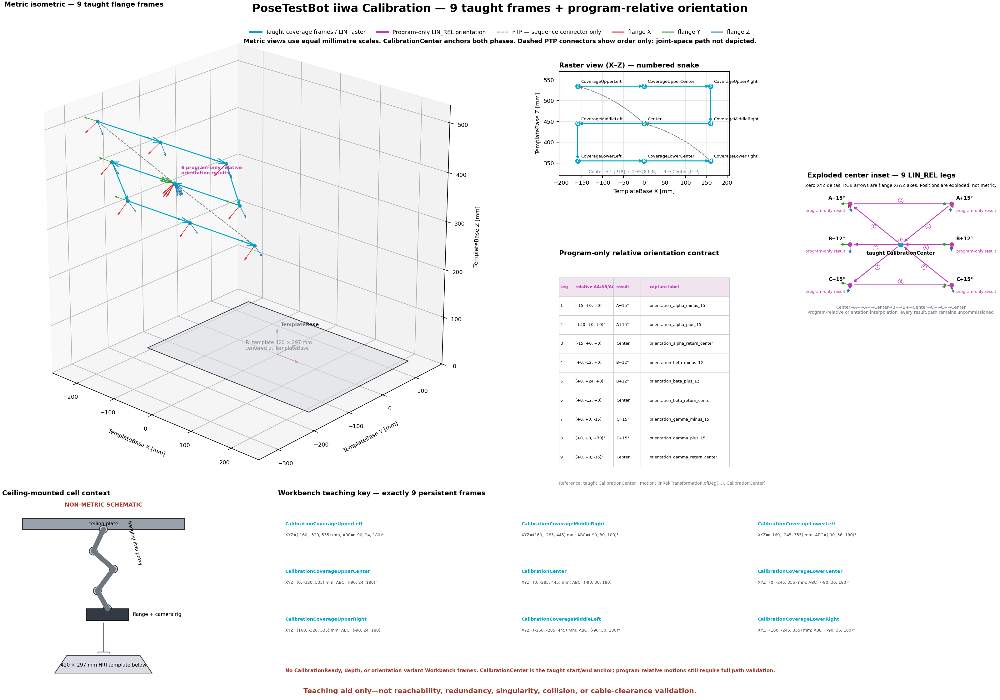

# IIWA Nine-Frame Calibration Teaching Program

## Outcome

`iiwa/PoseTestBot_CalibrationVarianceProposal.java` is an enabled repository
candidate for the operator-reported running calibration application. The exact
deployed controller application and revision are not yet captured as evidence.
Its Workbench contract is reduced to exactly nine persistent 3 × 3 raster
frames below `/PoseTestBot/TemplateBase`. `CalibrationCenter` is one of those
nine frames and anchors both phases.

A separate retained 2026-07-23 guided campaign captured three independent
eye-in-hand calibration attempts for all three RealSense cameras; see the
[dated validation record](EYE_IN_HAND_CALIBRATION_VALIDATION_20260723.md).
Their reusable profile collections were later retired because they predate
required Auto time-alignment provenance. The retained runs document historical
acquisition and attempt evidence, but do not establish which Sunrise
application/revision was deployed or supply the Workbench, offline-path, T1,
and reviewer evidence required to commission this source candidate.

The six A/B/C orientation variants are no longer Workbench frames. Sunrise
generates their nine motion legs with zero-translation `linRel` transformations
relative to the taught center. The depth phase and its two frames are removed.

The repository owns three related commissioning artifacts:

- the versioned [machine-readable teaching plan](../iiwa/calibration_teaching_plan.v2.json),
  containing the nine seeds, center-anchored raster route, relative deltas,
  documented result offsets, and capture labels;
- the printable [Workbench teaching and commissioning checklist](IIWA_CALIBRATION_TEACHING_CHECKLIST.md);
- the reproducible [SVG engineering plot](images/iiwa_calibration_teaching_plan.svg)
  and [PNG rendering](images/iiwa_calibration_teaching_plan.png).

[](images/iiwa_calibration_teaching_plan.svg)

The 420 × 297 mm template and all nine taught flange frames in the metric views
are drawn relative to `TemplateBase`. The ceiling-mounted robot/camera-rig inset
is explicitly non-metric because this repository has no registered iiwa
CAD/URDF, joint configurations, ceiling height, or
physical-base-to-TemplateBase transform.

## Application Data Contract

Validate the existing `/PoseTestBot/TemplateBase`, then create these nine direct
children with the robot flange selected as the teaching and motion point.
Values are uncommissioned initial seeds in millimetres and KUKA A/B/C degrees.

| Child frame | X | Y | Z | A | B | C |
| --- | ---: | ---: | ---: | ---: | ---: | ---: |
| `CalibrationCoverageUpperLeft` | -160 | -320 | 535 | -90 | 24 | 180 |
| `CalibrationCoverageUpperCenter` | 0 | -320 | 535 | -90 | 24 | 180 |
| `CalibrationCoverageUpperRight` | 160 | -320 | 535 | -90 | 24 | 180 |
| `CalibrationCoverageMiddleRight` | 160 | -285 | 445 | -90 | 30 | 180 |
| `CalibrationCenter` | 0 | -285 | 445 | -90 | 30 | 180 |
| `CalibrationCoverageMiddleLeft` | -160 | -285 | 445 | -90 | 30 | 180 |
| `CalibrationCoverageLowerLeft` | -160 | -245 | 355 | -90 | 36 | 180 |
| `CalibrationCoverageLowerCenter` | 0 | -245 | 355 | -90 | 36 | 180 |
| `CalibrationCoverageLowerRight` | 160 | -245 | 355 | -90 | 36 | 180 |

There are no `CalibrationReady`, depth, or orientation-variant Application Data
frames in this revision. Existing `/PoseTestBot/CalibrationCirc01`–`03` remain
untouched.

The manifest is the plotting and consistency-test authority. Sunrise Java
resolves the nine Workbench frames by absolute path during `initialize()` and
does not read numeric seeds at runtime. Missing frames therefore fail before
the UDP wait or motion.

## Program Sequence

Before running an enabled phase, the application commands a slow PTP to the
taught `CalibrationCenter` anchor. Before the first start command, the operator
must manually position the robot at or near that center pose. This is logged as
a commissioning requirement and is not presented as an enforced safety check.

| Phase | Ordered route | Motion contract |
| --- | --- | --- |
| Coverage | Center → upper-left → upper-center → upper-right → middle-right → center → middle-left → lower-left → lower-center → lower-right → Center | Center transits are PTP; the eight raster legs are captured LIN motions. |
| Orientation | Center → A−15° → A+15° → Center → B−12° → B+12° → Center → C−15° → C+15° → Center | All nine legs are captured zero-translation `LIN_REL` motions referenced to the taught center. |

The relative dither uses these program-owned deltas:

| Leg | Relative ΔA | Relative ΔB | Relative ΔC | Result from center |
| ---: | ---: | ---: | ---: | --- |
| 1 | -15° | 0° | 0° | A−15° |
| 2 | +30° | 0° | 0° | A+15° |
| 3 | -15° | 0° | 0° | Center |
| 4 | 0° | -12° | 0° | B−12° |
| 5 | 0° | +24° | 0° | B+12° |
| 6 | 0° | -12° | 0° | Center |
| 7 | 0° | 0° | -15° | C−15° |
| 8 | 0° | 0° | +30° | C+15° |
| 9 | 0° | 0° | -15° | Center |

The program constructs each offset with `Transformation.ofDeg(0, 0, 0,
ΔA, ΔB, ΔC)` and executes `linRel(offset, calibrationCenter)`. It moves to the
absolute taught center before each capture command, so a new run re-establishes
the anchor rather than assuming a prior relative state. The nine relative legs
themselves remain stateful and must complete in order.

This intentionally changes the original orientation phase from joint-space PTP
to Cartesian relative orientation interpolation. Reducing the frame count
reduces teaching work, not commissioning work: all six result orientations and
all nine swept paths still require Workbench and physical T1 validation. The
installed Sunrise.OS Javadoc is authoritative for the available `linRel`
overload and must be checked during Workbench compilation.

The receiver's `cartesian_velocity_m_s` is converted to Sunrise millimetres per
second, reduced to 60% for this calibration program, and clamped to 8–30 mm/s
for raster and relative motions. Repositioning PTP motions use 8% relative
joint velocity. All PTP, raster `LIN`, and orientation `LIN_REL` motions use 3%
relative joint-acceleration and joint-jerk limits to soften starting and
braking. Because a Cartesian translation limit alone does not suitably limit a
zero-translation orientation move, every central dither also uses an explicit
3% relative joint-velocity limit.

The normal host workflow sends no more than 0.03, so its 60%-scaled calibration
translation is at most 18 mm/s; the 30 mm/s Sunrise cap also protects commands
from other clients. New runs default to 0.01 m/s, which the calibration
application scales and then clamps to its 8 mm/s minimum. These software
limits are not safety-rated, and slow motion alone does not guarantee sharp
images: exposure/readout time and lighting still have to be verified.

The separately acknowledged Dashboard/Devices manual motion test sends `0.1`
instead of the run-owned acquisition value. This application scales that
request and clamps the resulting translation to its existing 30 mm/s maximum;
repositioning and orientation limits remain unchanged.

The program preserves exact stops instead of blending between commissioned
waypoints, then waits 1.5 seconds after every motion leg so residual cell or
camera-rig vibration can decay before the next direction change. It transmits
settled robot-pose samples after each dwell so stable camera frames retain
synchronization candidates. These limits do not replace the reduced pendant
override and T1 checks required during commissioning.

The UDP stop message is read only while waiting for another start command. It
cannot interrupt active motion and is not a safety control. In the current
application it exits the wait loop and requires a manual application restart,
so repeated calibration captures must use new start commands without sending
`STOP` between them.

## Plot Contract and Regeneration

The plot uses the existing KUKA pose decoder. Manifest A/B/C degrees are
converted to radians before transformation. It includes:

- an equal-scale metric isometric view of the exact template and nine taught
  flange frames, with the six program-only relative results overlaid at center;
- a numbered raster view with solid LIN legs and dashed PTP order connectors;
- an exploded center inset showing the nine `LIN_REL` legs and RGB flange axes;
- a machine-readable-delta table and nine-frame Workbench teaching key;
- a non-metric ceiling plate → hanging iiwa proxy → flange/camera rig → template
  cell schematic;
- the joint-space-path caveat and full teaching-aid safety disclaimer.

No flange axis is described as a camera optical axis because this teaching plot
does not consume run-specific camera-to-flange transforms. The historical
three-camera transforms remain in the
[dated validation record](EYE_IN_HAND_CALIBRATION_VALIDATION_20260723.md) and
its retained run artifacts. The historical `/HRC_Hub/Template_Base` A1 sweep
is not overlaid because no transform to `/PoseTestBot/TemplateBase` is
available.

Matplotlib is a direct project dependency. Regenerate both committed outputs
without opening hardware:

```bash
MPLCONFIGDIR=/tmp/posetestbot-mpl UV_CACHE_DIR=/tmp/uv-cache \
  uv run python scripts/plot_iiwa_calibration_teaching_plan.py
```

## Commissioning and Acceptance

Use the [printable checklist](IIWA_CALIBRATION_TEACHING_CHECKLIST.md) for frame
creation, touch-up read-back, per-frame reviewer sign-off, Workbench endpoint
and swept-path checks, T1 single-stepping, and the supervised capture trial.

The repository source currently sets `ENABLE_AFTER_OFFLINE_VALIDATION=true` for
lab validation. This does not establish that the controller is running this
exact source. Record the deployed application and revision, and retain the
Workbench compile, nine-frame resolution, path simulation, and T1 evidence;
the boolean alone does not prove commissioning. Future application or cell
changes must be revalidated before physical capture. Physical T1 validation
and capture are operator-run work. Repository tests never access the robot or
cameras.

For every required camera, a future supervised trial must demonstrate at least
15 accepted views, 6/9 coverage cells, strong extreme detections, per-view
reprojection no greater than 3 px, sufficient motion diversity, and passing
synchronization quality. A manual OpenCV intrinsic fallback additionally
requires no greater than 1.5 px training RMS plus its held-out and plausibility
gates; that RMS is not a factory-profile requirement.

The retained three-camera repeat met the applicable RGB calibration gates and
did not reproduce the earlier high-error result for RealSense `825412070181`:
its promoted mean reprojection was 1.040 px. This is completed run evidence, not
controller commissioning evidence. Factory SDK depth scale and depth-to-color
alignment were not recalibrated, so the separate metric-depth validation item
remains open.

## Limits and Assumptions

- “Swivel” means the existing flange A/B/C orientation dither. It does not mean
  changing the iiwa redundancy/swivel angle while preserving an identical
  Cartesian flange pose.
- Frame names such as “upper” and “left” describe intended image-space outcomes;
  verify them in every required camera rather than inferring them from
  TemplateBase signs.
- Removing `CalibrationReady` removes the separate high-clearance transit
  anchor. Every center-to-raster PTP and the manual approach to center must be
  assessed for the actual cell.
- The depth sweep is removed. Add it back only through a separately reviewed
  taught or relative-motion design.
- The plot's template is the measured 420 × 297 mm HRI template. The ArUco board
  is not drawn to scale until its physical size and placement are supplied.
