# PoseTestBot System Overview And Rewrite Baseline

This document is a current-state architecture reference for PoseTestBot and a
baseline for a future rewrite. It is intentionally detailed: the goal is to make
the existing workflows, data contracts, coupling points, and rewrite risks clear
enough that a future maintainer can rebuild the system in a more modular but
more unified form.

The current repository is mostly a collection of standalone scripts around a
robotic RGB-D capture and pose-estimation evaluation workflow. A small Flask UI
exists, but most system behavior still lives in interactive command-line scripts,
external tools, camera SDKs, robot-side Java code, and folder-level data
contracts.

## Executive Summary

PoseTestBot automates the creation and evaluation of 6D object pose-estimation
datasets with a KUKA LBR iiwa robot and RGB-D sensors.

At a high level:

1. A KUKA iiwa robot moves a sensor setup through predefined trajectories around
   a template/object area.
2. RGB-D sensors record color and depth frames with millisecond timestamp file
   names.
3. The robot streams end-effector poses over UDP while moving.
4. Python scripts synchronize sensor frames with robot poses.
5. Optional ArUco estimation estimates marker/template pose in captured frames.
6. BlenderProc renders synthetic ground-truth annotations from known object
   models, robot poses, camera calibration, and camera-to-end-effector transforms.
7. Pose-estimation wrappers, currently mainly FoundationPose, run on the captured
   frames and generated masks.
8. Evaluation scripts compare estimated object poses to BlenderProc ground truth
   or compare ArUco estimates to robot-derived ground truth.
9. Aggregation scripts combine per-run metrics into tabular results.

Additional rewrite requirements:

- Support both eye-in-hand cameras mounted to the robot and static eye-to-hand
  cameras mounted to the test cell.
- Add robust hand-eye calibration and static-camera extrinsic calibration,
  including repeatability checks and outlier rejection.
- Use synchronized sensor timestamps for image/robot-pose synchronization rather
  than relying only on file-name timestamps.
- Support Intel RealSense D435, Luxonis OAK-D Pro, and ZED 2i capture adapters
  that return aligned RGB-D frames.
- Prefer Astral `uv` for Python environment management and reproducibility.
- Make BOP scenewise dataset format the canonical output so BOP Toolkit can be
  used for downstream evaluation.

The future rewrite should preserve this end-to-end capability, but make it:

- Modular: hardware adapters, pipeline stages, estimators, and evaluators should
  be isolated behind clear interfaces.
- Unified: a central web application should configure, launch, monitor, and
  inspect capture, rendering, estimation, and evaluation jobs.
- Maintainable: contracts should be typed, validated, logged, versioned, and
  testable without physical hardware where possible.

## Current High-Level Architecture

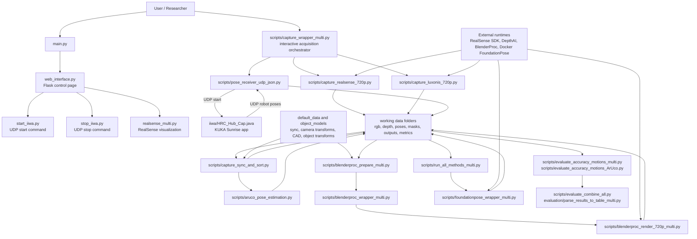

Important current-state observation: the UI is not the orchestrator for the full
pipeline. The real system is currently operated through scripts. The web UI only
launches a few commands synchronously.

## Repository Component Map

| Path | Role | Main inputs | Main outputs / effects | Notes |
| --- | --- | --- | --- | --- |
| `README.md` | Minimal project overview, citations | None | Human project metadata | Not a full usage or architecture guide. |
| `main.py` | Starts the Flask UI process and opens a browser | `web_interface.py` | Web server at `127.0.0.1:5000` | Blocks until the web process exits. |
| `web_interface.py` | Thin Flask control UI | Browser requests | Runs selected scripts via `subprocess.check_output` | Only supports start iiwa, stop iiwa, and RealSense visualization. |
| `start_iiwa.py` | Sends a UDP start-like command to the robot | Robot IP/port, start value | UDP JSON command | Sends `{"start": 0.2}` by default. Function names still say stop. |
| `stop_iiwa.py` | Sends a UDP stop command to the robot | Robot IP/port | UDP JSON command | Sends `{"stop": true}`. Robot Java currently does not explicitly handle this key. |
| `iiwa/HRC_Hub_Cap.java` | KUKA Sunrise robot application | UDP start message | Robot motion and UDP pose stream | Defines hard-coded motion sequence and pose packet shape. |
| `realsense_multi.py` | Multi-RealSense live visualization | Connected RealSense devices | OpenCV display windows | Visualization only, not dataset recording. |
| `scripts/capture_wrapper_multi.py` | Interactive capture and preparation orchestrator | User prompts, sensors, robot, default config | Run folders with sensor data and downstream artifacts | Central CLI pipeline script today. |
| `scripts/capture_realsense_720p.py` | RealSense RGB-D capture | Output folder, FPS, optional serial | `rgb/`, `depth/`, camera calibration files | Saves timestamp-named PNG frames. |
| `scripts/capture_luxonis_720p.py` | Luxonis/DepthAI RGB-D capture | Output folder, FPS | `rgb/`, `depth/`, camera calibration files | Current wrapper passes `--device`, but this script does not define it. |
| `scripts/pose_receiver_udp_json.py` | Robot pose receiver and capture trigger | Output folder, receiver IP/port, robot IP/port, velocity | `raw_robot_ee_poses.json` | Sends robot start command, then records incoming pose packets. |
| `scripts/capture_sync_and_sort.py` | Frame and robot-pose synchronization | Sensor folder, sync deltas, raw robot poses | Renamed frames, `match_robot_ee_poses.json`, copied defaults | Deletes frames outside robot motion windows unless dry-run. |
| `scripts/aruco_pose_estimation.py` | ArUco grid-board pose estimation | Sensor `rgb/`, `cam_K.txt`, `match_robot_ee_poses.json` | `aruco_pose_estimation.json`, optional `aruco/` images | Uses OpenCV ArUco dictionary `DICT_5X5_50` and 4x3 grid board. |
| `scripts/transform_sensor_to_ee.py` | Computes sensor-to-end-effector transforms from ArUco data | ArUco pose JSON | `_with_sensor_to_ee.json`, `_average.json` | Calibration helper. |
| `scripts/blenderproc_prepare_multi.py` | Prepares BlenderProc input per sensor/object | Sensor folders, object models, camera-to-EE transforms | `blenderproc/` folders with camera/object `.npy` files | Builds camera trajectories from robot poses and camera calibration. |
| `scripts/blenderproc_wrapper_multi.py` | Runs BlenderProc over sensor folders | Prepared `blenderproc/` folder and render script | `masks/`, `blenderproc/output/` | Calls `blenderproc run ...` and moves BOP output. |
| `scripts/blenderproc_render_720p_multi.py` | BlenderProc scene renderer | Camera poses, K matrix, objects | BOP-style ground truth, depth, color, masks | Requires BlenderProc runtime. |
| `scripts/foundationpose_wrapper_multi.py` | Runs FoundationPose in Docker | Sensor data, masks, object CAD, camera intrinsics | `foundationpose*_output/` folders | Processes frames grouped by robot motion. |
| `scripts/run_all_methods_multi.py` | Orchestrates estimator wrappers | Prepared dataset | Estimator outputs | Currently FoundationPose-focused; MegaPose and SAM6D paths are present but disabled/commented. |
| `scripts/evaluate_accuracy.py` | Basic pose-estimation evaluation | Estimator outputs, BlenderProc ground truth | `accuracy_HRC-Hub.json` | Older/non-motion-oriented evaluator. |
| `scripts/evaluate_accuracy_motions_multi.py` | Motion-grouped estimator evaluation | Estimator outputs, BlenderProc ground truth, motion frames | Per-sensor `accuracy_HRC-Hub.json` | Computes AP and RP metrics per motion and all motions. |
| `scripts/evaluate_accuracy_motions_ArUco.py` | Motion-grouped ArUco evaluation | ArUco estimates, robot-derived ArUco ground truth | `accuracy_ArUco_HRC-Hub.json` | Uses camera-to-EE calibration and fixed ArUco-to-base transform. |
| `scripts/evaluate_combine_all.py` | Combines accuracy JSON files | Experiment folder tree | `all_results.json` when script path is adjusted | Main directory is currently hard-coded placeholder. |
| `evaluation/parse_results_to_table_multi.py` | Converts combined results to tables | `all_results.json` | CSV and Excel tables | Assumes specific experiment/run naming convention. |
| `scripts/ROI_generation/*` | Mask perturbation and ROI helper scripts | `masks/` folders | Modified masks / bounding-box-like variants | Used for ROI-quality experiments. |
| `object_models/` | CAD models, optional textures, object-template transforms | `.ply`, `.png`, `objects.json` | Inputs for BlenderProc and FoundationPose | Object transforms are central to ground truth. |
| `scripts/default_data/` | Default calibration and sync data | JSON config | Copied into run folders | Contains camera-to-EE transforms and sensor sync deltas. |

## Current Runtime Entrypoints

### Web UI Entrypoints

`main.py` starts `web_interface.py` as a subprocess, waits one second, and opens
`http://127.0.0.1:5000/` in the default browser.

`web_interface.py` exposes:

- `GET /`: returns an inline HTML page with Bootstrap loaded from a CDN.
- `POST /run-command`: accepts a JSON body with a `command` key.

Supported command values:

| Command | Script launched | Current behavior |
| --- | --- | --- |
| `start_iiwa` | `start_iiwa.py` | Sends UDP `{"start": 0.2}` to robot IP/port. |
| `stop_iiwa` | `stop_iiwa.py` | Sends UDP `{"stop": true}` to robot IP/port. |
| `realsense_multi` | `realsense_multi.py` | Opens RealSense visualization windows. |

The current web UI is synchronous. It waits for the launched command to finish
and returns captured stdout. Long-running capture, visualization, rendering, or
estimation processes can block the request.

### Robot Control Entrypoints

`start_iiwa.py` and `pose_receiver_udp_json.py` can both send a robot start
message. They target these defaults:

- Robot IP: `172.31.1.147`
- Robot port: `30300`
- Receiver/listener IP: `172.31.1.151`
- Receiver/listener port: `8080`

`stop_iiwa.py` sends a `stop` message, but `iiwa/HRC_Hub_Cap.java` currently
waits for a JSON object containing `start`. The Java application does not show a
matching stop-message branch in the current code.

### Capture Entrypoint

`scripts/capture_wrapper_multi.py` is the current high-level CLI workflow for
recording and optional preparation. It:

- Prompts for output path, autostart, resolution, capture velocity, FPS, and
  sensor choices.
- Discovers connected RealSense and Luxonis devices.
- Starts one sensor-capture subprocess per detected device.
- Starts `pose_receiver_udp_json.py`, which triggers robot motion and records
  robot poses.
- Terminates capture subprocesses after the pose receiver exits.
- Runs synchronization and optional ArUco estimation.
- Optionally prepares and runs BlenderProc rendering.

### Estimation Entrypoint

`scripts/run_all_methods_multi.py` currently orchestrates FoundationPose runs
through `foundationpose_wrapper_multi.py`. It includes commented or disabled
paths for MegaPose and SAM6D.

### Evaluation Entrypoints

The most complete current evaluators are:

- `scripts/evaluate_accuracy_motions_multi.py`: compares estimator outputs to
  BlenderProc ground truth, grouped by robot motion.
- `scripts/evaluate_accuracy_motions_ArUco.py`: compares ArUco pose estimates to
  robot/calibration-derived ArUco ground truth.
- `scripts/evaluate_combine_all.py`: combines per-sensor/per-object result JSON.
- `evaluation/parse_results_to_table_multi.py`: converts combined JSON to CSV
  and Excel files.

## Hardware And External Dependencies

| Dependency | Used by | Purpose | Current coupling |
| --- | --- | --- | --- |
| KUKA LBR iiwa with Sunrise | `iiwa/HRC_Hub_Cap.java`, UDP scripts | Executes repeatable robot motions and streams end-effector poses | Hard-coded IPs, ports, frames, and motion waypoints. |
| Intel RealSense SDK / `pyrealsense2` | `realsense_multi.py`, `capture_realsense_720p.py`, wrapper discovery | RGB-D capture and live visualization for RealSense devices; target sensor is RealSense D435 | Direct SDK calls in scripts. |
| Luxonis DepthAI / `depthai` | `capture_luxonis_720p.py`, wrapper discovery | RGB-D capture from OAK/Luxonis devices; target sensor is OAK-D Pro | Direct SDK calls in scripts. |
| ZED SDK / Python API | Not implemented yet | Required future RGB-D capture support for ZED 2i | Needs a new capture adapter. |
| OpenCV | Capture display, ArUco, ROI scripts | Image IO, display, ArUco detection, mask manipulation | Direct calls, GUI windows in capture loops. |
| BlenderProc | `blenderproc_wrapper_multi.py`, render script | Renders BOP-style synthetic ground truth and masks | Called through shell command `blenderproc run ...`. |
| FoundationPose Docker container | `foundationpose_wrapper_multi.py` | Object pose estimation from RGB-D and masks | Assumes Docker container named `foundationpose`. |
| BOP Toolkit | Not integrated yet | Required future evaluation backend for BOP-format datasets and estimator result CSVs | Should be invoked after dataset export and method output conversion. |
| Astral `uv` | `pyproject.toml`, `uv.lock` | Python environment and dependency management | Already present; future scripts should prefer `uv run ...` and locked dependencies. |
| `pytransform3d` | Transform, BlenderProc prep, evaluation | Coordinate transformations and transform management | Shared math dependency but no central transform module. |
| `pandas` | Synchronization and result parsing | Frame/pose matching and table output | Used in script-local logic. |
| Object CAD and textures | `object_models/` | Object geometry for rendering and estimation | File names must match object names in `objects.json`. |
| Calibration JSON files | `scripts/default_data/` | Camera-to-EE transforms and sync deltas | Copied into dataset folders during sync. |

## Target Sensor Support And Frame Contract

The rewrite should support three first-class RGB-D camera families:

| Sensor | Mounting modes | Required capture output | SDK/runtime | Notes |
| --- | --- | --- | --- | --- |
| Intel RealSense D435 | Eye-in-hand or static test-cell mount | Color image, depth image aligned to color, intrinsics, depth scale, sensor timestamp | `pyrealsense2` | Current RealSense code already aligns depth to color, but the rewrite needs a shared frame contract and sensor timestamp metadata. |
| Luxonis OAK-D Pro | Eye-in-hand or static test-cell mount | RGB image, depth aligned to RGB, intrinsics, depth scale, device timestamp | DepthAI | Current Luxonis code needs device selection, path ownership cleanup, and timestamp export. |
| ZED 2i | Eye-in-hand or static test-cell mount | Left RGB image, depth aligned to left RGB, intrinsics, depth scale, sensor timestamp | ZED SDK Python API | New adapter/script required. |

Each capture adapter should return the same logical frame object:

```text
AlignedRgbdFrame
  sensor_id
  sensor_type
  frame_index
  sensor_timestamp_ns
  host_received_timestamp_ns
  rgb_image
  depth_image_aligned_to_rgb
  intrinsics
  depth_scale_to_mm
  exposure_metadata optional
  camera_pose_hint optional
```

The adapter should own SDK-specific details, but all downstream pipeline stages
should see the same contract. The canonical image pair must be an RGB frame and
a depth frame aligned to that RGB frame. If a camera provides multiple RGB
streams or coordinate frames, the adapter must declare which stream is canonical.

Required future capture scripts/modules:

| Future script or module | Responsibility |
| --- | --- |
| `posetestbot.sensors.realsense_d435` or `scripts/capture_realsense_d435.py` | Discover/select D435 devices, align depth to color, export BOP-ready RGB/depth frames and timestamps. |
| `posetestbot.sensors.oak_d_pro` or `scripts/capture_oak_d_pro.py` | Discover/select OAK-D Pro devices, align depth to RGB, export BOP-ready RGB/depth frames and timestamps. |
| `posetestbot.sensors.zed_2i` or `scripts/capture_zed_2i.py` | Capture ZED 2i left RGB plus aligned depth, export BOP-ready RGB/depth frames and timestamps. |
| `posetestbot.sensors.frame_writer` | Convert `AlignedRgbdFrame` objects into canonical BOP folders and metadata. |

Sensor timestamps should be used for synchronization. File names can still be
sequential BOP image IDs, but the source sensor timestamp, host receive
timestamp, and synchronization status should be stored in per-image metadata or
the dataset manifest.

## End-To-End Workflow

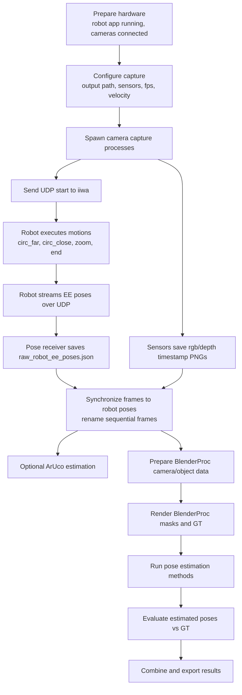

### Step 1: Prepare Hardware

The KUKA Sunrise application `iiwa/HRC_Hub_Cap.java` must be deployed and
running on the robot controller. It waits on UDP port `30300` for a JSON message
containing `start`.

The computer running the Python scripts must be reachable by the robot at the
receiver IP configured in Java, currently `172.31.1.151`, on UDP port `8080`.

RealSense and/or Luxonis cameras must be connected and available through their
respective SDKs.

### Step 2: Start Capture

The capture workflow is launched through:

```bash
python scripts/capture_wrapper_multi.py
```

The wrapper asks for:

- Output path, defaulting near `scripts/../working_data`.
- Whether to autostart.
- Resolution, currently expected as `720p` or `360p`.
- Robot capture velocity.
- Capture FPS.
- Whether to capture RealSense.
- Whether to capture Luxonis.

Autostart defaults in the code:

| Setting | Autostart value |
| --- | --- |
| Capture RealSense | `True` |
| Capture Luxonis | `True` |
| Capture velocity | `0.2` |
| Capture FPS | `6` |
| Resolution | `720p` |
| Run ArUco after sync | `False` in the autostart branch, although a later branch invokes ArUco with save images in autostart mode. |

### Step 3: Capture Sensor Frames

RealSense capture:

- Uses `pyrealsense2`.
- Aligns depth to color.
- Saves color frames to `rgb/<timestamp>.png`.
- Saves depth frames to `depth/<timestamp>.png`.
- Saves camera intrinsics and depth scale in multiple formats.

Luxonis capture:

- Uses DepthAI.
- Builds a color/stereo-depth pipeline.
- Aligns depth to RGB.
- Saves color and depth frames to `rgb/` and `depth/`.
- Saves camera intrinsics and depth scale in multiple formats.

Both capture scripts use millisecond timestamps as frame names before
synchronization.

### Step 4: Capture Robot Poses

`pose_receiver_udp_json.py` sends a UDP start message to the robot and then
binds to the receiver IP/port to collect robot pose packets. It records each
received packet with:

- A local receive timestamp in milliseconds.
- A frame delta from the previous received robot pose.
- The robot motion name.
- The end-effector pose values.

The receiver stops when the robot sends a packet whose `motion` value is `end`.

### Step 5: Synchronize Sensor Frames To Robot Poses

`capture_sync_and_sort.py` expects a sensor folder containing:

- `rgb/`
- `depth/`
- `raw_robot_ee_poses.json`

It then:

- Loads sensor-specific sync delta values.
- Groups robot pose timestamps by motion name.
- For each RGB frame, applies the sync delta.
- Keeps frames whose delayed timestamp falls inside a robot motion window.
- Deletes frames outside robot motion windows unless `--dry_run` is set.
- Renames kept frames to sequential names such as `000000.png`.
- Moves matching depth frames to the same sequential names.
- Selects the closest robot pose for each kept image.
- Writes `match_robot_ee_poses.json`.
- Copies default `camera_ee_transform.json` and `sync_data.json` to the run
  folder.

Target rewrite behavior:

- Use the sensor SDK/device timestamp as the primary image timestamp.
- Record a host monotonic receive timestamp for every image and robot pose.
- Store the mapping between sensor clock, host clock, and robot/receiver clock
  in the run manifest.
- Treat file names as stable image IDs, not as the authoritative timestamp.
- Avoid destructive synchronization by preserving raw captures and writing a
  derived BOP split/scene view.
- Report synchronization quality, including dropped frames, timestamp gaps,
  motion-window coverage, and nearest-pose deltas.

### Step 6: Optional ArUco Pose Estimation

`aruco_pose_estimation.py` reads each sensor folder and expects:

- `rgb/`
- `cam_K.txt`
- `match_robot_ee_poses.json`

It detects markers from `cv.aruco.DICT_5X5_50` on a `4 x 3` grid board with:

- Marker length: `50`
- Marker separation: `65`

It writes `aruco_pose_estimation.json`, which is the synchronized pose file plus
an `aruco_pose_estimation` object per frame.

### Step 7: Prepare BlenderProc Ground Truth

`blenderproc_prepare_multi.py` operates at a run/object folder level. It expects
sensor subfolders and reads:

- Sensor `cam_K.txt`.
- Sensor `match_robot_ee_poses.json`.
- Object transforms from `object_models/objects.json`.
- Object CAD and optional textures from `object_models/`.
- Camera-to-end-effector transforms from `camera_ee_transform.json`.

For each object and sensor it writes a `blenderproc/` subfolder containing:

- `camera_matrix.npy`
- `dist_coefficients.npy`
- `camera_poses.npy`
- `objects.json`
- `objects/<object>.ply`
- `objects/<object>.png`, if available
- `objects/<object>.npy`, the object-to-template transform

The central transform chain is:

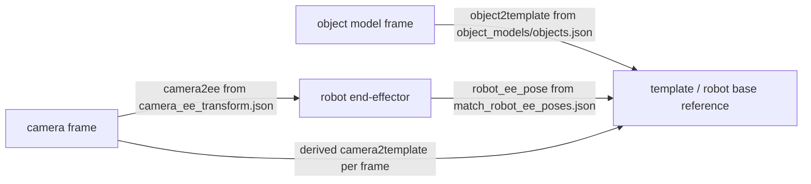

## Calibration Strategy For Robot-Mounted And Static Cameras

The rewrite must support both camera mounting classes:

- Eye-in-hand: camera is rigidly mounted to the robot flange/end effector.
- Eye-to-hand/static: camera is rigidly mounted to the test cell and observes
  the robot/object area from a fixed external position.

Both cases should be represented by explicit calibration profiles. A calibration
profile should include the sensor identity, mounting mode, intrinsic model,
depth scale, extrinsic transform, calibration target, calibration dataset ID,
method, residual statistics, date, operator, and validity status.

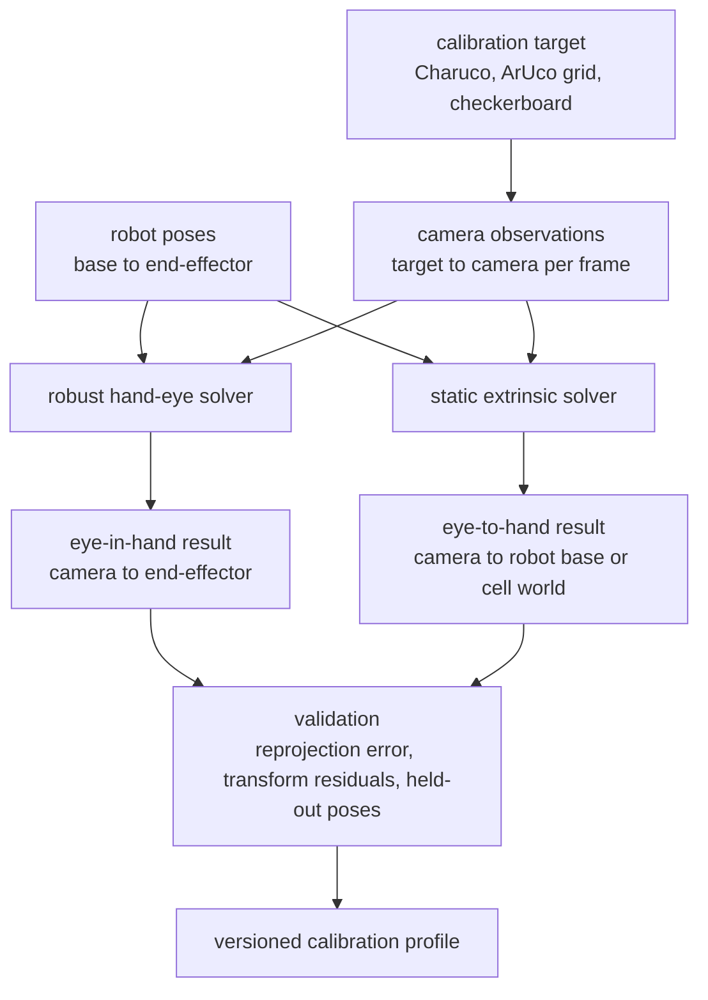

### Eye-In-Hand Calibration

For robot-mounted cameras, the target transform is the rigid transform from
camera frame to end-effector frame, currently represented as `camera2ee` in
`camera_ee_transform.json`.

Target behavior:

- Capture many robot poses with diverse rotations and translations.
- Detect a calibration target in every camera stream.
- Estimate target-to-camera observations for each image.
- Solve the hand-eye problem with multiple algorithms where available, such as
  Tsai, Park, Horaud, Andreff, or Daniilidis via OpenCV-compatible APIs.
- Add robust estimation around the solver: reject outlier observations, compare
  methods, run leave-one-out or held-out validation, and store residuals.
- Store the chosen camera-to-EE transform with covariance or at least summary
  quality metrics.

### Static Eye-To-Hand Calibration

For static test-cell cameras, the target transform is not camera-to-EE. It is a
fixed camera-to-robot-base or camera-to-cell-world transform.

Target behavior:

- Use robot motion and target observations to solve the static camera extrinsic.
- Store static cameras as `mounting_mode: static` with a transform such as
  `camera2base`, `base2camera`, or `world2camera`, choosing one canonical
  direction and documenting it.
- Support multiple static cameras in the same test cell.
- Validate static calibration by comparing predicted target/object projections
  against observed image locations across held-out robot poses.

### Calibration Data Contract

A future calibration artifact should look conceptually like:

```json
{
  "schema_version": "calibration.v1",
  "sensor_id": "realsense_d435_123456",
  "sensor_type": "realsense_d435",
  "mounting_mode": "eye_in_hand",
  "intrinsics": {
    "cam_K": [0.0, 0.0, 0.0, 0.0, 0.0, 0.0, 0.0, 0.0, 1.0],
    "distortion": [],
    "depth_scale_to_mm": 1.0
  },
  "extrinsics": {
    "from": "camera",
    "to": "end_effector",
    "rotation_quaternion_wxyz": [1.0, 0.0, 0.0, 0.0],
    "translation_mm": [0.0, 0.0, 0.0]
  },
  "quality": {
    "num_observations": 0,
    "num_inliers": 0,
    "mean_reprojection_error_px": 0.0,
    "max_reprojection_error_px": 0.0
  }
}
```

The current `camera_ee_transform.json` can be treated as a legacy calibration
profile and migrated into this richer format.

### Step 8: Render BlenderProc Ground Truth

`blenderproc_wrapper_multi.py` calls:

```bash
blenderproc run scripts/blenderproc_render_720p_multi.py <camera_poses.npy> <camera_matrix.npy> <sensor/blenderproc>
```

The render script:

- Loads each object from `blenderproc/objects/`.
- Applies object transforms.
- Sets the BlenderProc camera intrinsics from `camera_matrix.npy`.
- Adds one camera pose per synchronized real frame.
- Enables depth output.
- Writes BOP output.

The wrapper then:

- Moves `train_pbr/000000/mask` to the sensor-level `masks/` folder.
- Renames `train_pbr/000000` to `blenderproc/output`.
- Removes the temporary `train_pbr` folder.

### Step 9: Run Pose Estimation Methods

`run_all_methods_multi.py` currently runs FoundationPose variants through
`foundationpose_wrapper_multi.py`.

FoundationPose wrapper behavior:

- Starts Docker container `foundationpose`.
- Copies object CAD, optional texture, and `cam_K.txt` into a temporary folder.
- Scales the CAD mesh.
- Groups frames by robot motion using `match_robot_ee_poses.json`.
- For each motion, copies matching `rgb/`, `depth/`, and `masks/` frames into a
  FoundationPose temporary scene folder.
- Runs either `run_demo.py` or `run_demo_no_tracking.py` inside Docker.
- Copies `ob_in_cam/` and `track_vis/` outputs into a final
  `foundationpose*_output/` folder.

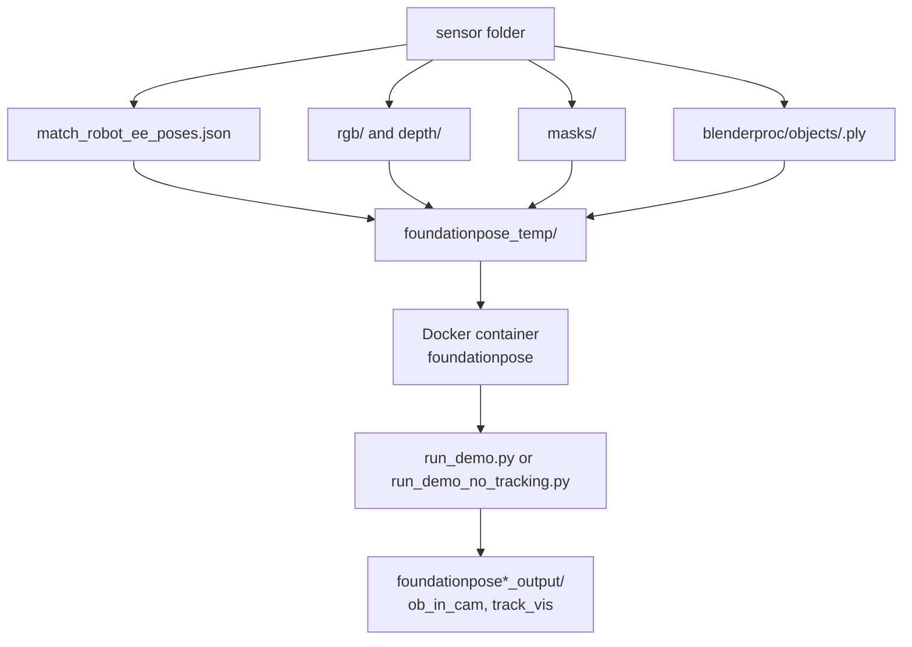

MegaPose and SAM6D launcher functions exist in `run_all_methods_multi.py`, but
they reference wrappers that are not present in the current file list and their
execution is commented out.

### Step 10: Evaluate Accuracy

The motion-aware evaluator reads:

- BlenderProc ground truth from `blenderproc/output/scene_gt.json`.
- Pose-estimator outputs from folders containing `output` in the name.
- Motion/frame groupings from `match_robot_ee_poses.json`.
- Object names from `blenderproc/objects.json`.

It computes per-motion and all-motion metrics:

- `AP_p`: magnitude of average position error.
- `ap_x`, `ap_y`, `ap_z`: average translation error components.
- `ap_a`, `ap_b`, `ap_c`: average orientation errors.
- `RP_i`: radial position repeatability-like metric.
- `RP_a`, `RP_b`, `RP_c`: orientation spread metrics.
- Raw component lists `x`, `y`, `z`, `a`, `b`, `c`.

The ArUco evaluator computes analogous metrics by comparing detected ArUco poses
to robot/calibration-derived ArUco poses.

## Robot UDP Communication Contract

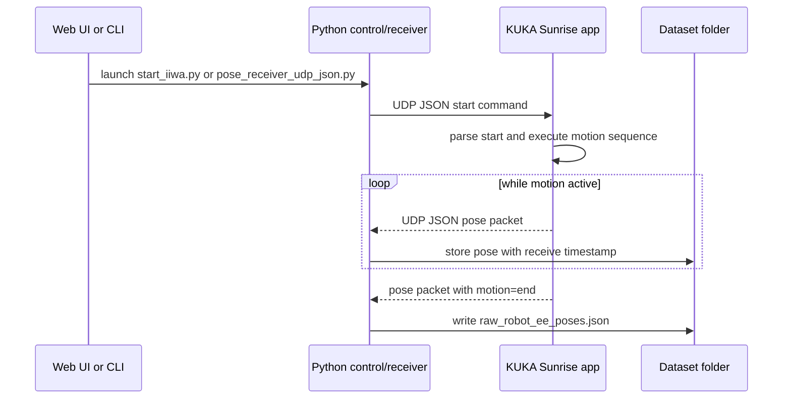

### Start Command

Python sends a JSON object containing `start`.

```json
{"start": 0.2}
```

`pose_receiver_udp_json.py` sends the configured `capture_vel` as the value:

```json
{"start": "<capture_vel>"}
```

Current rewrite risk: `iiwa/HRC_Hub_Cap.java` casts the parsed `start` value to
`Long`, but the Python default is a floating-point value (`0.2`). This should be
validated because JSON-simple normally parses decimal JSON numbers as `Double`.
If the cast fails, the Java code catches the exception silently and keeps
waiting.

### Stop Command

`stop_iiwa.py` sends:

```json
{"stop": true}
```

Current rewrite risk: the Java code shown in this repository waits for messages
with a `start` key. There is no explicit `stop` branch in the current robot
application code.

### Robot Pose Packet

The robot sends UDP packets shaped like:

```json
{
  "motion": "circ_far",
  "X": 0.0,
  "Y": 0.0,
  "Z": 0.0,
  "A": 0.0,
  "B": 0.0,
  "C": 0.0
}
```

Observed motion names:

- `circ_far`
- `circ_close`
- `zoom`
- `end`

`X`, `Y`, and `Z` are robot Cartesian positions in the robot template reference
frame. `A`, `B`, and `C` are rotation values in radians as reported by the KUKA
frame.

## Sensor Capture And Synchronization Flow

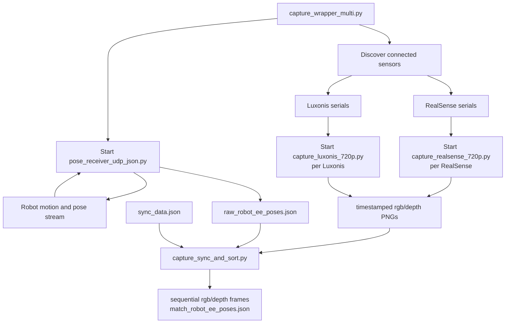

The synchronization step is destructive by default: it removes frames outside
detected motion windows and renames retained frames. Use `--dry_run` to inspect
matching behavior without moving or deleting frames.

## Dataset Folder And Artifact Lifecycle

The expected dataset layout is implicit and script-driven. A typical intended
shape is:

```text
working_data/
  <timestamp>_<resolution>_<capture_vel>_<fps>/
    <run_or_object_name>/
      camera_ee_transform.json
      sync_data.json
      <sensor_name>/
        rgb/
          000000.png
          000001.png
        depth/
          000000.png
          000001.png
        cam_K.txt
        depthscale.txt
        camera.json
        camera_data.json
        raw_robot_ee_poses.json
        match_robot_ee_poses.json
        aruco_pose_estimation.json
        aruco/
        blenderproc/
          camera_matrix.npy
          dist_coefficients.npy
          camera_poses.npy
          objects.json
          objects/
            <object>.ply
            <object>.png
            <object>.npy
          output/
            scene_gt.json
            scene_camera.json
        masks/
          000000_000000.png
        foundationpose_est5_track2_obj0_output/
          ob_in_cam/
          track_vis/
        foundationposeNoTracking_est5_track2_obj0_output/
          ob_in_cam/
          track_vis/
        accuracy_HRC-Hub.json
        accuracy_ArUco_HRC-Hub.json
    all_results.json
```

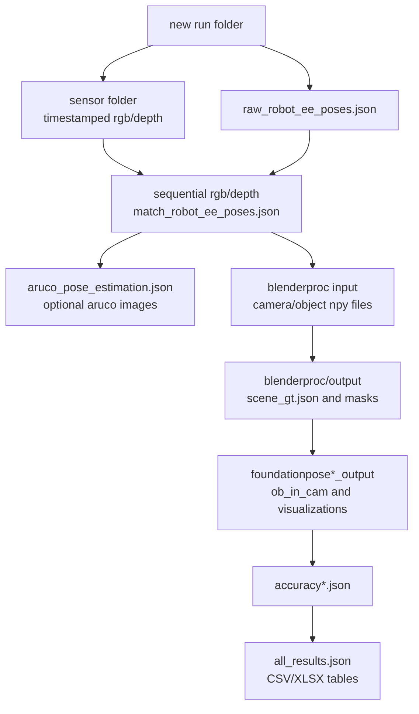

## Target BOP Dataset Output

The rewrite should make BOP scenewise format the canonical dataset output.
The current custom working-data layout may remain as a raw/internal staging area,
but exported datasets should be consumable by the BOP Toolkit without a custom
post-processing step.

Reference:

- BOP Toolkit: <https://github.com/thodan/bop_toolkit>
- BOP scenewise/imagewise/webdataset conventions are implemented under the BOP
  Toolkit dataset modules and documented by the BOP project.

Target root layout:

```text
DATASET_NAME/
  camera[_CAMTYPE].json
  dataset_info.json
  test_targets_bop19.json
  test_targets_bop24.json
  test_targets_multiview_bop25.json optional
  models[_MODELTYPE]/
    models_info.json
    obj_000001.ply
  models[_MODELTYPE]_eval/
    models_info.json
    obj_000001.ply
  train|val|test[_SPLITTYPE]/
    SCENE_ID/
      scene_camera[_CAMTYPE].json
      scene_gt[_CAMTYPE].json
      scene_gt_info[_CAMTYPE].json
      scene_gt_coco[_CAMTYPE].json
      rgb[_CAMTYPE]/
        000000.png
      depth[_CAMTYPE]/
        000000.png
      mask[_CAMTYPE]/
        000000_000000.png
      mask_visib[_CAMTYPE]/
        000000_000000.png
```

`[_CAMTYPE]` and `[_SPLITTYPE]` should be used deliberately for multi-sensor
data. For this project, they can encode sensor types or calibrated sensor
profiles, for example:

- `test_realsense_d435`
- `test_oak_d_pro`
- `test_zed_2i`
- `test_static_realsense_d435`
- `test_eih_oak_d_pro`

The exact naming should be decided once the data model separates sensor type,
sensor serial, mounting mode, and calibration profile.

### BOP Scene Camera Contract

Each BOP scene must include `scene_camera.json`. Per image it should include:

- `cam_K`: 3x3 camera matrix saved row-wise.
- `depth_scale`: factor to convert stored depth pixels to millimeters.
- `cam_R_w2c` and `cam_t_w2c` where world/cell/robot-base pose is known.
- Additional project metadata in the manifest for sensor timestamps and sync
  quality.

The BOP camera coordinate convention follows the OpenCV-style camera frame with
the camera looking along the positive Z axis. The rewrite should make all
coordinate conversions explicit at the BOP export boundary.

### BOP Ground Truth Contract

Each BOP scene must include `scene_gt.json`. Per image/object annotation it
should include:

- `obj_id`
- `cam_R_m2c`: model-to-camera rotation, row-wise 3x3 matrix.
- `cam_t_m2c`: model-to-camera translation in millimeters.

`scene_gt_info.json` should be generated with bounding boxes, pixel counts, and
visible fraction. `scene_gt_coco.json` should be generated when COCO-style
segmentation or BOP detection evaluation is needed.

Depth images should be 16-bit unsigned PNGs. Object models and translation
vectors should use millimeters at the BOP export boundary.

### BOP Result And Evaluation Contract

Estimator wrappers should write or convert predictions into BOP-compatible
result files. For pose evaluation, this usually means one CSV per dataset/method
with image ID, scene ID, object ID, score, rotation, translation, and runtime
fields as required by the selected BOP evaluation script.

The future evaluation module should support:

- Exporting BOP predictions from FoundationPose, MegaPose, SAM6D, and ArUco
  where applicable.
- Running BOP Toolkit evaluation scripts against the exported dataset.
- Keeping legacy PoseTestBot metrics only as optional additional reports.
- Storing BOP evaluation output beside the method result file and linking it in
  the run manifest.

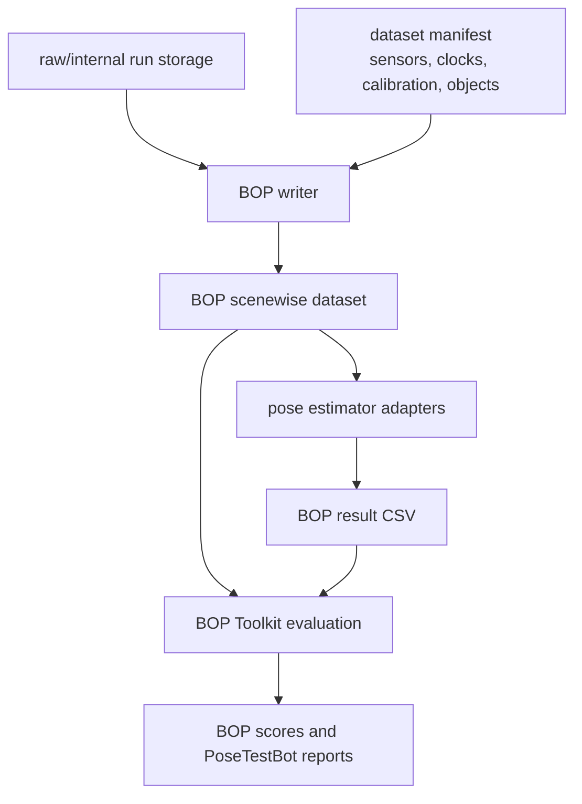

## File And Data Contracts

### Camera Intrinsics

Each sensor capture writes multiple camera files for different downstream tools.

| File | Producer | Consumer | Contract |
| --- | --- | --- | --- |
| `cam_K.txt` | Capture scripts | ArUco, BlenderProc prep, FoundationPose | 3x3 intrinsic matrix as text. Some readers also expect a fourth line with distortion coefficients. |
| `depthscale.txt` | Capture scripts | FoundationPose-style pipelines | Single scale value. RealSense stores depth scale multiplied by `1000`; Luxonis stores `1.0`. |
| `camera.json` | Capture scripts | SAM6D-style pipelines | Contains flattened `cam_K` and `depth_scale`. |
| `camera_data.json` | Capture scripts | MegaPose-style pipelines | Contains matrix `K` and `resolution`. |

Current rewrite risk: `blenderproc_prepare_multi.py` reads a fourth line of
`cam_K.txt` as distortion coefficients, while current capture scripts appear to
write only the three intrinsic-matrix lines. The rewrite should make camera
calibration a typed data model and validate it before running BlenderProc prep.

### Calibration And Synchronization Config

`scripts/default_data/camera_ee_transform.json` maps sensor names to:

- `quaternion`
- `position`

Example top-level keys:

- `luxonis`
- `realsense`

`scripts/default_data/sync_data.json` maps sensor types to millisecond sync
deltas:

- `luxonis`
- `realsense`

Current rewrite risk: some scripts use sensor type names such as `realsense`,
while capture wrappers create serial-specific folder names such as
`realsense_<serial>`. Any future system should separate:

- Sensor type: `realsense`, `luxonis`
- Sensor instance ID: hardware serial / MX ID
- Logical sensor label: user-facing name for calibration lookup

### Robot Pose Files

`raw_robot_ee_poses.json` is written by `pose_receiver_udp_json.py`. Shape:

```json
{
  "0": {
    "framename": 1710000000000,
    "frame_delta": 0,
    "motion": "circ_far",
    "pose": {
      "X": 0.0,
      "Y": 0.0,
      "Z": 0.0,
      "A": 0.0,
      "B": 0.0,
      "C": 0.0
    }
  }
}
```

`match_robot_ee_poses.json` is written by `capture_sync_and_sort.py`. Shape:

```json
{
  "000000.png": {
    "motion": "circ_far",
    "image_frame": 1710000000123,
    "delayed_frame": 1710000000010,
    "frame_delta": 0,
    "robot_frame": 1710000000008,
    "robot_ee_pose": {
      "X": 0.0,
      "Y": 0.0,
      "Z": 0.0,
      "A": 0.0,
      "B": 0.0,
      "C": 0.0
    }
  }
}
```

Current rewrite risk: `capture_wrapper_multi.py` tries to copy
`pose_data.json` into each sensor folder, but `pose_receiver_udp_json.py`
writes `raw_robot_ee_poses.json`. Since `capture_sync_and_sort.py` expects
`raw_robot_ee_poses.json` inside the sensor folder, this naming mismatch can
break the acquisition pipeline.

### ArUco Output

`aruco_pose_estimation.json` extends the matched robot pose JSON with:

```json
{
  "aruco_pose_estimation": {
    "rvec": [0.0, 0.0, 0.0],
    "tvec": [0.0, 0.0, 0.0],
    "len_ids": 0
  }
}
```

### Object Model Contract

`object_models/objects.json` maps object names to 4x4 transforms. Matching
object files are expected in `object_models/`:

- `<object>.ply`
- Optional `<object>.png`

BlenderProc prep copies those into each sensor's `blenderproc/objects/` folder
and writes `<object>.npy` for the object transform.

### BlenderProc Ground Truth

Important generated artifacts:

- `blenderproc/camera_matrix.npy`
- `blenderproc/dist_coefficients.npy`
- `blenderproc/camera_poses.npy`
- `blenderproc/objects.json`
- `blenderproc/output/scene_gt.json`
- `masks/`

`scene_gt.json` is the main pose ground-truth file used by estimator evaluation.
Mask file names are used by FoundationPose and must align with RGB/depth frame
names and object IDs.

### Pose-Estimator Output

FoundationPose outputs are read from:

- `foundationpose*_output/ob_in_cam/`

Each file contains a 4x4 transform matrix. The evaluators convert translation
from meters to millimeters for FoundationPose output.

Expected output folder patterns include:

- `foundationpose_est5_track2_obj0_output`
- `foundationposeNoTracking_est5_track2_obj0_output`

### Accuracy Output

Main generated accuracy files:

- `accuracy_HRC-Hub.json`
- `accuracy_ArUco_HRC-Hub.json`
- `all_results.json`

The motion-aware accuracy JSON stores method names at the top level, then motion
names under each method, including `all_motions`.

## BlenderProc Ground-Truth Generation Flow

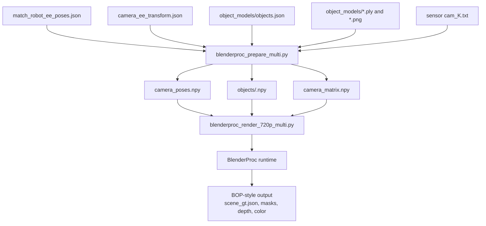

## Evaluation And Result Aggregation Flow

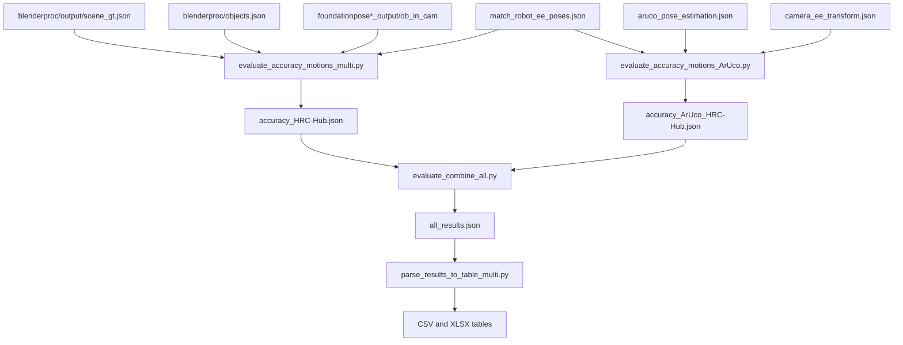

## Current Dependency And Coupling Graph

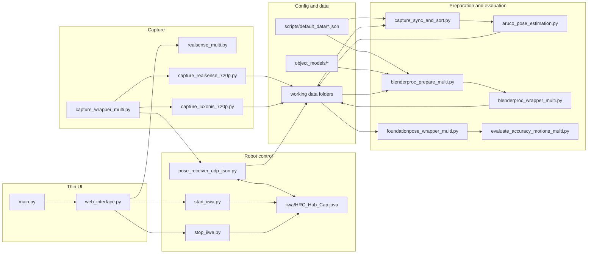

## Known Maintainability Issues And Rewrite Risks

These are observations from the current codebase that should be treated as
rewrite inputs, not criticism of the research prototype.

| Area | Current issue | Rewrite implication |
| --- | --- | --- |
| Web app | The Flask UI only launches three scripts and blocks on command completion. | Build a real job-oriented web app with async execution, logs, status, cancellation, and artifact browsing. |
| Robot protocol | Python sends float `start` values, Java casts to `Long`. | Define a typed robot command schema and validate command values on both sides. |
| Stop control | Python sends `{"stop": true}`, Java does not show stop handling. | Add explicit robot command states and safety semantics. |
| Pose file naming | Wrapper looks for `pose_data.json`, receiver writes `raw_robot_ee_poses.json`. | Make artifact names constants in one module and validate stage inputs. |
| Sensor naming | Some configs use sensor type names, while wrappers create serial-specific folders. | Separate sensor type, sensor instance, calibration profile, and display name. |
| Luxonis wrapper | Wrapper passes `--device=<serial>`, but `capture_luxonis_720p.py` does not define `--device`. | Adapter interfaces should expose supported device-selection parameters. |
| Luxonis output nesting | Capture script appends `luxonis` under the provided output path. | Standardize output path ownership: caller chooses final sensor folder, adapter writes inside it. |
| Calibration format | Some readers expect distortion coefficients in `cam_K.txt`; capture scripts write only K. | Use a structured calibration file and generate legacy files as derived artifacts. |
| Shell execution | Some wrappers use `shell=True` or split strings by spaces. | Use structured command arrays and a job runner with logging and exit-code capture. |
| Hard-coded defaults | IPs, ports, object paths, FoundationPose container name, and placeholder paths are hard-coded. | Move environment-specific values into versioned config profiles. |
| External tool coupling | FoundationPose and BlenderProc are invoked directly from scripts. | Wrap estimators/renderers behind stable pipeline interfaces. |
| Folder contract | Many scripts assume exact folder names and relative locations. | Introduce a dataset manifest and artifact registry. |
| Interactive prompts | Capture workflow depends on prompts. | Replace with explicit run configuration from UI/API/CLI. |
| GUI loops | Capture scripts use OpenCV windows inside capture loops. | Separate capture, preview streaming, and recording control. |
| Error handling | Several robot-side and wrapper exceptions are swallowed or only printed. | Centralize logging, structured errors, and stage-level failure reporting. |
| Testing | No visible automated test suite for contracts or pipeline stages. | Add unit tests for transforms, schemas, path resolution, and dry-run pipeline behavior. |

## Proposed Modular Rewrite Architecture

The desired future shape is one central web application controlling modular
backend services. The webapp should be unified from the user's perspective, but
the backend should be split by responsibility.

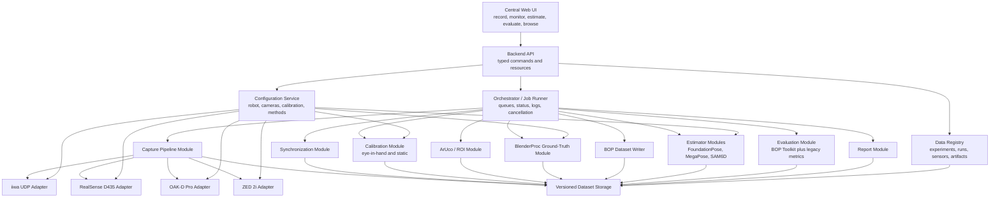

### Target Modules

#### Web UI

Responsibilities:

- Configure experiments, runs, sensors, robot velocity, FPS, resolution, objects,
  calibration profiles, BOP export settings, estimators, and evaluation options.
- Start, pause where safe, stop, and monitor jobs.
- Show live logs and stage status.
- Show connected hardware status.
- Show captured aligned RGB-D frames, synchronized frames, calibration quality,
  masks, pose outputs, BOP export status, and metrics.
- Export BOP datasets, BOP result files, reports, and tables.

The UI should not directly call scripts. It should call backend API endpoints
that create jobs.

#### Backend API

Responsibilities:

- Expose typed resources: experiments, runs, sensors, calibration profiles,
  object models, BOP datasets, pipeline jobs, estimator configurations,
  artifacts, metrics.
- Validate user input before launching jobs.
- Return structured errors instead of raw script stdout.
- Provide artifact URLs or file references for browsing.

#### Orchestrator / Job Runner

Responsibilities:

- Run long-running capture, calibration, BOP export, render, estimation, and
  evaluation tasks.
- Track job status: queued, running, succeeded, failed, canceled.
- Stream logs.
- Capture stdout/stderr.
- Store job parameters and produced artifacts.
- Prevent unsafe concurrent hardware operations.

Rewrite target: every pipeline stage should be runnable as a job with explicit
inputs, explicit outputs, and a stage result.

#### Hardware Adapters

Adapters should hide SDK/protocol details from the pipeline.

Suggested interfaces:

| Adapter | Key operations |
| --- | --- |
| iiwa UDP adapter | Discover/check reachability, send start command, send stop command, receive pose stream, validate protocol version. |
| RealSense D435 adapter | List devices by serial, open stream, align depth to color, capture `AlignedRgbdFrame`, read intrinsics and sensor timestamps, close stream. |
| OAK-D Pro adapter | List devices by MX ID, open stream, align depth to RGB, capture `AlignedRgbdFrame`, read intrinsics and device timestamps, close stream. |
| ZED 2i adapter | List/open ZED cameras, capture left RGB plus aligned depth, capture `AlignedRgbdFrame`, read intrinsics and SDK timestamps, close stream. |

Adapters should support test doubles so synchronization and orchestration can be
tested without physical hardware.

#### Data Model Layer

Suggested core entities:

| Entity | Description |
| --- | --- |
| Experiment | Top-level research campaign or batch. |
| Run | One capture session for one object/setup. |
| Sensor | Sensor instance with type, serial, calibration profile, and stream settings. |
| Frame | RGB/depth frame pair with timestamp and synchronized sequence index. |
| RobotPose | End-effector pose packet with robot timestamp or receive timestamp. |
| MotionSegment | Named motion interval such as `circ_far`, `circ_close`, or `zoom`. |
| CalibrationProfile | Camera intrinsics, depth scale, mounting mode, eye-in-hand or static extrinsic transform, sync delta, and validation quality. |
| ObjectModel | CAD, texture, object-to-template transform, object ID. |
| PipelineJob | A stage execution with config, logs, status, and artifacts. |
| EstimatorRun | Pose-estimation method config and output artifacts. |
| EvaluationResult | Per-motion and aggregate metrics. |
| BopDataset | Canonical exported dataset with scenes, images, ground truth, models, targets, and evaluation-ready metadata. |

The current folder layout can remain initially, but a manifest should describe
it. For example, each run could have a `dataset_manifest.json` that records
paths, schema version, sensors, object IDs, calibration versions, and completed
stages.

#### Pipeline Modules

Recommended module boundaries:

- Capture module: robot trigger, pose receiving, synchronized sensor recording.
- Sync module: timestamp correction, motion-window filtering, sequential frame
  naming, pose matching.
- Calibration module: camera intrinsics, robust eye-in-hand hand-eye
  calibration, static eye-to-hand calibration, sync deltas, ArUco/Charuco-derived
  calibration helpers, calibration validation reports.
- ArUco/ROI module: ArUco detection, marker visualization, mask perturbation,
  ROI generation.
- Ground-truth module: BlenderProc preparation and rendering.
- BOP writer module: converts raw/internal run artifacts into canonical BOP
  scenewise datasets, including models, scenes, camera files, ground truth,
  masks, visible masks, target files, and metadata.
- Estimator module: FoundationPose, MegaPose, SAM6D, and future methods through
  a common adapter interface.
- Evaluation module: BOP Toolkit invocation, BOP result CSV conversion,
  pose readers, optional legacy metric calculations, per-motion grouping.
- Report module: BOP scores, combined JSON, CSV, Excel, plots.

#### Configuration Layer

Configuration should move out of hard-coded script defaults and into profiles.

Suggested config groups:

- Robot profile: IP, command port, receiver IP, receiver port, protocol version,
  supported motions.
- Sensor profile: type, serial, mounting mode, resolution, FPS, timestamp source,
  depth behavior, preview settings.
- Calibration profile: camera intrinsics, depth scale, distortion, eye-in-hand
  camera-to-EE transform or static camera-to-base/world transform, sync delta,
  validation metrics.
- Object registry: object ID, CAD path, texture path, object-to-template
  transform.
- Estimator profile: method name, runtime type, Docker/container settings,
  refinement iterations, ROI/mask source.
- BOP dataset profile: dataset name, split names, scene ID policy, camera type
  suffix policy, model folder policy, target-file generation policy.
- Storage profile: root folder, BOP export folder, raw artifact retention policy,
  manifest schema version.

#### Storage Layout

The storage layer should make the existing implicit contracts explicit and treat
BOP scenewise format as the canonical public/exported dataset format. A
versioned manifest allows old data to remain readable while newer pipeline
stages become stricter.

Recommended principles:

- The caller creates the run and sensor folders.
- Each stage declares exactly which artifacts it consumes and produces.
- Raw files are preserved unless the user explicitly requests cleanup.
- Derived files are separated from raw files, with BOP export treated as a
  derived public dataset.
- Stage outputs include metadata: tool version, command/config, start/end time,
  exit status, and input artifact checksums where useful.
- BOP export includes `models`, split/scene folders, `scene_camera.json`,
  `scene_gt.json`, `scene_gt_info.json`, masks, depth, RGB, targets, and
  method-result CSVs where applicable.

#### Environment Management With uv

The repository already contains `pyproject.toml` and `uv.lock`. The rewrite
should lean into Astral `uv` as the primary Python environment manager.

Target behavior:

- Use `uv sync` to create/update the local environment.
- Use `uv run ...` for project CLIs and scripts where practical.
- Keep hardware-specific optional dependencies grouped behind extras, for
  example RealSense, DepthAI, ZED, BlenderProc, BOP Toolkit, and development
  tools.
- Avoid ad hoc conda/pip instructions inside individual scripts unless an
  external estimator requires a separate runtime.
- Treat FoundationPose, BlenderProc, and BOP Toolkit as explicit runtime
  profiles, not hidden assumptions.

The BOP Toolkit repository also supports `uv sync`, so integrating BOP
evaluation into this project should not require abandoning the uv-first
environment strategy.

## Suggested Migration Strategy

1. Freeze and document the current artifact schema.
   - Add a manifest for existing dataset folders.
   - Define constants for artifact names.
   - Add validators for required files per stage.

2. Extract pure Python modules from scripts.
   - Move transform math, synchronization logic, pose readers, and metric
     calculations into importable modules.
   - Keep CLI wrappers as thin compatibility entrypoints.

3. Introduce typed configuration.
   - Replace hard-coded IPs, ports, paths, and method settings with config files.
   - Add a small set of known profiles for the current lab setup.

4. Build hardware adapters.
   - Wrap RealSense D435, OAK-D Pro, ZED 2i, and iiwa UDP access.
   - Add fake adapters for test and demo runs.

5. Add robust calibration workflows.
   - Implement eye-in-hand hand-eye calibration for robot-mounted cameras.
   - Implement static eye-to-hand calibration for test-cell-mounted cameras.
   - Store calibration profiles with residuals, inlier counts, and validation
     status.

6. Add BOP dataset export.
   - Convert internal capture artifacts into BOP scenewise datasets.
   - Generate models, scene camera files, scene ground truth, masks, target
     files, and dataset metadata.
   - Preserve raw/internal data separately from public BOP export.

7. Add an orchestrator.
   - Convert capture, sync, ArUco, BlenderProc, FoundationPose, and evaluation
     into jobs.
   - Capture logs and status.

8. Expand the webapp.
   - Use the existing Flask app only as a starting point or replace it with a
     fuller backend/frontend stack.
   - The first useful milestone is a web UI that can configure and launch a
     complete capture job and show stage logs.

9. Add estimator plugin support.
   - Give FoundationPose, MegaPose, SAM6D, and future estimators a common input
     and output contract.
   - Convert method outputs into BOP-compatible result CSVs.
   - Keep tool-specific wrappers isolated.

10. Add BOP Toolkit evaluation integration.
   - Run BOP Toolkit evaluation scripts against exported datasets and result
     CSVs.
   - Keep legacy PoseTestBot metrics as optional supplementary outputs.

11. Add automated tests around contracts.
   - Validate JSON schemas.
   - Test synchronization with synthetic sensor and robot timestamps.
   - Test transform chains with fixed matrices.
   - Test BOP export using a tiny fixture scene.
   - Test evaluator readers with small fixture outputs.

## Rewrite Acceptance Criteria

A successful rewrite should be able to:

- Discover connected RealSense D435, OAK-D Pro, and ZED 2i cameras and show
  their status in the web UI.
- Start a robot capture run from the web UI with explicit robot, sensor, object,
  FPS, velocity, and resolution settings.
- Capture aligned RGB-D frames from every supported sensor adapter.
- Record sensor timestamps, host timestamps, RGB-D frames, and robot poses into
  a manifest-backed run folder.
- Synchronize frames and robot poses using sensor timestamps without destructive
  changes to raw data.
- Calibrate robot-mounted eye-in-hand cameras and static eye-to-hand cameras
  with robust validation and stored residual metrics.
- Run ArUco estimation and display detection coverage.
- Prepare and run BlenderProc ground-truth rendering as a tracked job.
- Export a BOP scenewise dataset with models, camera files, ground truth, masks,
  visible masks, target files, RGB, and depth images.
- Run FoundationPose and later other estimators through a common method
  interface.
- Convert estimator outputs into BOP-compatible result files.
- Evaluate estimator results with BOP Toolkit and optionally compute legacy
  PoseTestBot per-motion metrics.
- Export `all_results.json`, CSV, and Excel reports.
- Manage the Python environment primarily with `uv`.
- Show job logs, failures, produced artifacts, and next recommended pipeline
  steps from one central UI.

## Current Implementation Checklist For This Document

This document records the required current contracts:

- Python start message: `{"start": 0.2}` or configured capture velocity.
- Python stop message: `{"stop": true}`.
- Robot pose message fields: `motion`, `X`, `Y`, `Z`, `A`, `B`, `C`.
- Main generated artifacts:
  - `raw_robot_ee_poses.json`
  - `match_robot_ee_poses.json`
  - `aruco_pose_estimation.json`
  - `cam_K.txt`
  - `depthscale.txt`
  - `camera.json`
  - `camera_data.json`
  - `blenderproc/output/scene_gt.json`
  - `masks/`
  - `foundationpose*_output/`
  - `accuracy_HRC-Hub.json`
  - `accuracy_ArUco_HRC-Hub.json`
  - `all_results.json`
- Additional rewrite requirements recorded:
  - Robust hand-eye calibration for eye-in-hand cameras.
  - Static eye-to-hand calibration for test-cell-mounted cameras.
  - RealSense D435, OAK-D Pro, and ZED 2i aligned RGB-D capture adapters.
  - Sensor timestamp based image/robot-pose synchronization.
  - uv-first Python environment management.
  - Canonical BOP scenewise dataset output.
  - BOP Toolkit evaluation after estimator result conversion.

## Open Questions For The Rewrite

These questions should be answered before a complete rewrite starts:

- Should the robot controller be changed to accept floating-point capture
  velocities, or should Python always send integer velocity values?
- What is the intended stop behavior during an active robot motion?
- Should raw timestamped frames be preserved separately from synchronized
  sequential frames?
- Should sensor calibration be keyed by sensor type, physical serial,
  calibration profile, mounting mode, or a user-defined rig position?
- Which calibration target should be standardized for robust hand-eye and static
  calibration: Charuco, ArUco grid, checkerboard, or multiple supported target
  types?
- What clock synchronization method should be authoritative for each sensor:
  device timestamps, hardware trigger, host monotonic receive time, PTP/NTP, or
  a calibrated offset model?
- How should BOP `[_CAMTYPE]` and `[_SPLITTYPE]` suffixes encode sensor type,
  mounting mode, serial number, and calibration profile?
- Should BlenderProc remain the ground-truth generator, or should a lighter
  renderer/data model be introduced for some workflows?
- Which estimator methods are first-class targets: FoundationPose only, or also
  MegaPose and SAM6D?
- What should the canonical unit convention be across all modules: millimeters
  internally, meters internally, or explicit units per field?
- Should the future webapp be local-only for lab use, or designed for multi-user
  experiment management?
